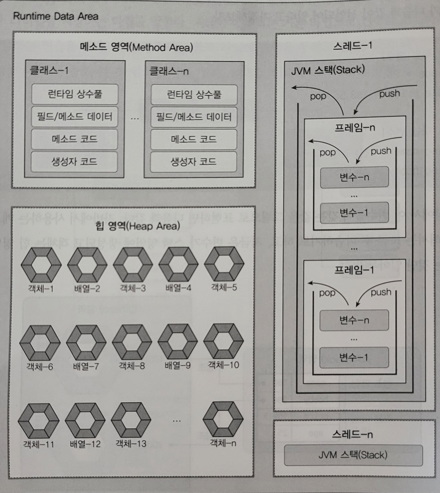

# 메모리 사용 영역
java.exe로 JVM이 시작되면 JVM은 운영체제에서 할당받은 메모리 영역(Runtime Data Area)을 다음과 같이 세부 영역으로 구분해서 사용한다.


## __Method Area__
___
메소드 영역에는 코드에서 사용되는 클래스(~.class)들을 클래스 로더로 읽어 클래스별로 런타임 상수풀, 필드 데이터, 메소드 데이터, 메소드 코드, 생성자 코드 등을 분류해서 저장한다. 메소드 영역은 __JVM이 시작할 때 생성되고 모든 스레드가 공유__ 하는 영역이다.

## __Head Area__
___
힙 영역은 객체와 배열이 생성되는 영역이다. 힙 영역에 생성된 객체와 배열은 JVM 스택 영역의 변수나 다른 객체의 필드에서 __참조__ 한다. 참조하는 변수나 필드가 없다면 의미 없는 객체가 되기 때문에 이것을 쓰레기로 취급하고 JVM은 GC(Gargabe Collector)를 실행시켜 쓰레기 객체를 힙 영역에서 자동으로 제거한다.

## __Stack Area__
___
JVM 스택 영역은 각 스레드마다 하나씩 존재하며 스레드가 시작될 때 할당한다. 자바 프로그램에서 추가적으로 스레드를 생성하지 않았다면 main 스레드만 존재하므로 JVM 스택도 하나이다. JVM 스택은 메소드를 호출할 때마다 Frame을 PUSH하고 메소드가 종료되면 해당 Frame을 POP하는 동작을 수행한다.</br>
 __예외 발생 시 printStackTrace() 메소드로 보여주는 Stack Trace의 각 라인은 하나의 Frame을 표현한다.__ </br>
 </br>
 Frame 내부에서는 로컬 변수 스택이 있는데, 기본 타입 변수와 참조 타입 변수가 PUSH되거나 POP된다. 변수가 해당 영역에 생성되는 시점은 최초로 변수에 값이 저장될 때이다. 변수는 선언된 블록 안에서만 스택에 존재하고 블록을 벗어나면 스택에서 제거된다.
 ```java
int a = 10; // (1)

if (a >= 10) {
    int b = 20; // (2)
    double c = 3.14; // (2)
}

boolean d = false; // (3)
 ```

선언된 변수는 실행 순서에 따라서 스택에 생성되고 소멸된다. </br>

|(1)실행|(2)실행|(3)실행|
|---|---|---|
|a - 10|c - 3.14 </br> b - 20 </br> a - 10| d - false </br> a - 10|

__기본 타입 변수는 스택 영역에 직접 값을 가지고 있지만, 참조 타입 변수는 값이 아니라 힙 영역이나 메소드 영역의 객체 주소를 가진다.__ 다음과 같이 배열 변수인 sample은 스택 영역에 생성되지만 실제 10, 20, 30을 갖는 배열은 힙 영역에 생성된다. 배열 변수 sample에는 배열의 힙 영역의 주소가 저장된다.
```java
int[] sample = {10, 20, 30}; // Heap 영역에 존재하는 배열 객체의 주소를 참조.
```
> 참조 : 이것이 자바다(신용권의 Java 프로그래밍 정복)