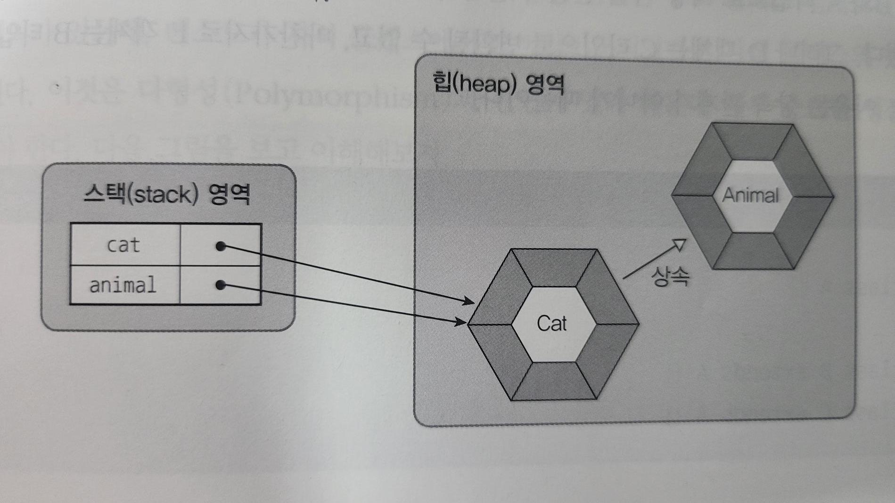

# 객체

## 목차
[1. 상속](#1-상속-개념) </br>
[2. 타입 변환과 다형성](#2-타입-변환과-다형성)
___

## 1. 상속 개념
객체 지향 프로그래밍에서 상속이란 부모 클래스의 멤버를 자식 클래스에게 물려줄 수 있는 개념이다. 프로그램에서는 부모 클래스를 상위 클래스라고 부르기도 하고, 자식 클래스를 하위 클래스, 또는 파생 클래스라고 부른다.

상속은 이미 잘 개발된 클래스를 재사용해서 새로운 클래스를 만들기 때문에 __코드의 중복을 줄여준다.__

```java
public class A {
    int field1;
    void method() { ... }
}

/**
 부모 클래스인 A의 필드 및 메소드 사용가능.
 단 접근제한자가 private이어선 안 된다.

 또한 각각의 클래스가 다른 패키지에 존재하면
 default 접근 제한자 또한 접근이 되지 않는다.
 */
public class B extends A {
    String field2;
    String method2() { ... }
}
```

### 1.1 부모 생성자 호출
___
자바에서 자식 객체를 생성하면, 부모 객체가 먼저 생성되고 자식 객체가 그 다음에 생성된다. 아래 코드는 B 객체만 생성하는 것처럼 보이지만, 내부적으로는 부모인 A 객체가 먼저 생성되고, B객체가 생성된다.

```java
public class A {
    int field1;
    void method() { ... }
}

public class B extends A {
    String field2;
    String method2() { ... }
}

B b = new B();
```

모든 객체는 클래스의 생성자를 호출해야만 생성되며, 부모 객체도 예외가 되지 않는다. B의 생성자가 명시적으로 선언되지 않았다면 컴파일러는 다음과 같은 기본 생성자를 생성해 낸다.

```java
public class B extends A {
    super();
}
```

super()는 부모의 기본 생성자를 호출하게되며 부모 생성자 A는 다음과 같은 생성자를 호출한다.

```java
public class A {

}
```

직접 자식 생성자를 선언하고 명시적으로 부모 생성자를 호출한다면 아래와 같이 한다. super는 반드시 자식 생성자 첫 줄에 위치해야 한다. 그렇지 않으면 컴파일 에러가 발생된다.

```java
public class B extends A {
    super();
    // something TODO...
}
```

### 1.2 메소드 재정의(Override)
___
부모 클래스의 모든 메소드가 자식 클래스에게 맞게 설계되어 있지 않을 수 있다. 따라서 상속된 일부 메소드는 자식 클래스에서 다시 수정해서 사용해야 한다. 이러한 경우 메소드 오버라이딩 기능을 사용하여 메소드를 재정의 할 수 있다.

메소드가 오버라이딩되었다면 __부모 객체의 메소드는 숨겨지기 때문에, 자식 객체에서 메소드를 호출하면 오버라이딩 된 메소드가 호출된다.__

```java
class A {
    void method1() { ... }
    void method2() { ... }
}

class B extends A {
    // 재정의 된 method1
    @Override
    void method1() { ... }
    void method3() { ... }
}

public class Main {
    public static void main(String[] args) {
        B b = new B();

        // Class B에서 재정의된 method1을 호출
        b.method1();

        // Class A에서 물려받은 method2를 호출
        b.method2();

        // Class B에서 정의한 method3을 호출
        b.method3();
    }
}

```

메소드를 오버라이딩할 떄는 다음과 같은 규칙에 주의해야한다.

1. 부모의 메소드와 동일한 시그니처(리턴 타입, 메소드 이름, 매개 변수 리스트)를 가져야 한다.
2. 접근 제한을 더 강하게 오버라이딩할 수 없다.
3. 새로운 예외(Exception)를 throws할 수 없다.

@Override 어노테이션은 생략해도 좋으나, 이것을 붙여주면 메소드가 정확히 오버라이딩된 것인지 __컴파일러가 체크__ 하기 때문에 개발자의 실수를 줄여준다.

### 1.3 부모 메소드 호출(super)
___
자식 클래스에서 부모 클래스의 메소드를 오버라이딩하게 되면, 부모 클래스의 메소드는 숨겨지고 오버라이딩된 자식 메소드만 사용된다. 그러나 자식 클래스 내부에서 오버라이딩된 부모 클래스의 메소드를 호출하고 싶을 경우 명시적으로 super 키워드를 붙여서 부모 메소드를 호출할 수 있다.

```java
class A {
    void method1() { ... }
    void method2() { ... }
}

class B extends A {
    // 재정의 된 method1
    @Override
    void method1() { ... }
    void method3() {
        this.method1();
        super.method1();
    }
}
```

### 1.4 final 클래스와 final 메소드
___
final 키워드는 클래스, 필드, 메소드 선언 시에 사용할 수 있다. 클래스와 메소드 선언 시에 final 키워드가 지정되면 상속과 관련이 깊어진다.

클래스를 선언할 때 final 키워드를 class 앞에 붙이게 되면 해당 클래스는 최종적인 클래스이므로 __상속할 수 없는 클래스가 된다.__ 즉 final 클래스는 __부모 클래스가 될 수 없어 자식 클래스를 만들 수 없다.__

```java
public final class A {

}

/**
 클래스 A는 final 클래스이기 때문에 상속할 수 없다.
*/
public class B extends A {

}

```

메소드를 선언할 때 final 키워드를 붙이게 되면 해당 메소드는 최종적인 메소드이므로 오버라이딩 할 수 없는 메소드가 된다. 즉, 부모 클래스를 상속해서 자식 클래스를 선언할 때 __부모 클래스에 선언된 final 메소드는 자식 클래스에서 재정의할 수 없다.__

```java
class A {
    final void method1() { ... }
    void method2() { ... }
}

class B extends A {
    // 부모 클래스의 method1은 final이기 때문에 Override를 할 수 없다.
    @Override
    void method1() { ... }
    void method3() {
        this.method1();
        super.method1();
    }
}
```

### 1.5 protected
___
protected 접근 제한자는 public과 default 접근 제한자의 중간쯤에 해당되며, 같은 패키지에서는 default와 같이 접근 제한이 없지만 다른 패키지에서는 자식 클래스만 접근을 허용한다.

```java
package a;

public class A {

	protected String a;
	
	protected A() {
		System.out.println("Init");
	}
	
	protected void method1() {
		System.out.println(a);
	}
	
}

```
```java
package a;

public class B {

	public B() {
		A a = new A();
        a.a = "test";
        a.method1();
	}
	
}
```
B클래스는 A클래스와 동일한 패키지에 존재하므로 B클래스의 생성자와 메소드에서는 A클래스의 protected 필드, 생성자, 메소드에 얼마든지 접근이 가능하다.

```java
package c;

import a.A;

public class C extends A {

	public C() {
		super();
		this.a = "test";
		this.method1();
	}
	
}
```
C클래스는 A클래스와 다른 패키지에 존재하나 A클래스의 자식 클래스이다. 따라서 A 클래스의 protected 필드, 생성자, 메소드에 접근이 가능하다. 단 new 연산자를 사용해서 생성자를 직접 호출 할 수 없고, __자식 생성자에서 super()로 A 생성자를 호출할 수 있다.__
___

## 2. 타입 변환과 다형성
다형성은 같은 타입이지만 실행 결과가 다양한 객체를 이용할 수 있는 성질을 말한다. 다형성을 위해 자바는 __부모 클래스로 타입 변환을 허용__ 한다. 즉, __부모 타입에 모든 자식 객체가 대입될 수 있다.__

```java
Animal dog = new Dog();
Animal cat = new Cat();
```

타입 변환이란 데이터 타입을 다른 데이터 타입으로 변환하는 행위를 말한다. 클래스 타입의 변환은 상속 관계에 있는 클래스 사이에서 발생한다. 자식 타입은 부모 타입으로 자동 타입 변환이 가능하다. Dog와 Cat이 Animal을 상속받을 경우 Animal 변수에 대입할 수 있다.

### 2.1 자동 타입 변환(Promotion)
___
자동 타입 변환은 프로그램 실행 도중에 자동적으로 타입 변환이 일어나는 것을 말한다.
```
부모클래스 변수 = 자식클래스타입;
```
자동 타입 변환의 개념은 자식은 부모의 특징과 기능을 상속받기 때문에 부모와 동일하게 취급될 수 있다.

```java
public class Animal {

}

public class Cat extends Animal {

}

Cat cat = new Cat();
Animal animal = cat;

cat == animal // true
```

Cat 클래스로부터 Cat 객체를 생성하고 이것을 Animal 변수에 대입하면 자동 타입 변환이 일어난다. cat과 Animal 변수는 타입만 다를 뿐, 동일한 Cat 객체를 참조한다. cat과 animal은 같은 주소값을 참조하기 때문에 eqaul 비교를 수행할 경우 true를 반환한다.



부모 타입으로 자동 타입 변환된 이후에는 __부모 클래스에 선언된 필드와 메소드만 접근이 가능하다.__ 비록 변수는 자식 객체를 참조하지만 변수로 접근 가능한 멤버는 부모 클래스 멤버로만 한정된다. 예외적으로 메소드가 자식 클래스에서 오버라이딩되었다면 자식 클래스의 메소드가 대신 호출된다.

### 2.2 필드의 다형성
___
자동 타입 변환은 __다형성__ 에 중요한 역할을 한다. 다형성은 동일한 타입을 사용하지만 다양한 결과가 나오는 성질이 있다. 주로 필드의 값을 다양화함으로써 실행 결과가 다르게 나오도록 구현하는데, __필드의 타입은 변함이 없지만, 실행 도중에 어떤 객체를 필드로 저장하느냐에 따라 실행 결과가 달라질 수 있다.__ 이것이 필드의 다형성이다.

자동차를 구성하는 부품은 언제든지 교체될 수 있다. 부품이 고장나거나, 보다 더 성능이 좋은 부품으로 교체되기도 한다. 객체 지향 프로그램에서도 마찬가지로, 프로그램은 수많은 객체들이 서로 연결되고 각자의 역할을 하게 되는데, 이 객체들은 다른 객체로 __교체__ 될 수 있어야 한다.

이것을 프로그램으로 구현하기 위해서는 __상속과 오버라이딩, 그리고 타입 변환__ 을 이용하는 것이다. 부모 클래스를 상속하는 자식 클래스는 부모가 가지고 있는 필드와 메소드를 가지고 있으나 사용 방법이 동일할 것이고, 자식 클래스는 부모의 메소드를 오버라이딩해서 메소드의 실행 내용을 변경할 수 있다.

```java
class Car {

    Tier frontLeft = new Tier();
    Tier frontRight = new Tier();
    Tier backLeft = new Tier();
    Tier backRight = new Tier();

    void run() {
        frontLeft.roll();
        frontRight.roll();
        backLeft.roll();
        backRight.roll();
     }

}
```
```java
class HankookTier extends Tier {

}

class KumhoTier extends Tier {

}
```
```java
Car car = new Car();
car.frontLeft = new HankookTier();
car.backLeft = new KumhoTier();
car.run();
```

Tier 클래스 타입인 frontLeft와 backLeft는 Tier 객체가 저장되어야 하지만, Tier의 자식 객체가 저장되어도 문제가 없다. 자식 타입은 부모 타입으로 __자동 타입 변환__ 이 되기 때문이다. frontLeft와 backLeft를 교체하기 전에는 Tier 객체의 roll() 메소드가 호출되지만 HankookTier와 KumhoTier로 교체가 되면 해당 객체의 roll() 메소드가 호출된다. 이것이 __필드의 다형성__ 이다.

### 2.3 매개 변수의 다형성
___
자동 타입 변환은 필드의 값을 대입할 때에도 발생하지만, 주로 메소드를 호출할 떄 많이 발생한다. 메소드를 호출할 때에는 매개 변수의 타입과 동일한 매개값을 저장하는 것이 정석이지만, __매개값을 다양화하기 위해 매개 변수에 자식 타입 객체를 지정할 수도 있다.__

```java
class Driver {
    void drive(Vehicle vehicle) {
        vehicle.run();
    }
}
```
```java
class Bus extends Vehicle {
    @Override
    public void run() { ... }
}
```
```java
Driver driver = new Driver();
Vehicle bus = new Bus();
driver.drive(bus);
```

drive() 메소드는 Vehicle 타입을 매개 변수로 선언했지만, Vehicle을 상속받는 Bus 객체가 매개값으로 사용되면 자동 타입 변환이 발생한다. 매개값으로 어떤 자식객체가 제공되느냐에 따라 메소드의 실행 결과는 다양해질 수 있다. 이것이 __매개 변수의 다형성__ 이다. 자식 객체가 부모의 메소드를 오버라이딩했다면 메소드 내부에서 오버라이딩된 메소드를 호출함으로써 메소드의 실행 결과는 다양해진다.


### 2.4 강제 타입 변환(Casting)
강제 타입 변환은 부모 타입을 자식 타입으로 변환하는 것을 말한다. 그렇다고 해서 모든 부모 타입을 자식 클래스 타입으로 강제 변환할 수 있는 것은 아니다. __자식 타입이 부모 타입으로 자동 변환 후, 다시 자식 타입으로 변환__ 할 떄 강제 타입 변환을 사용할 수 있다.

```
# 부모클래스 타입은 자식 타입이 부모 타입으로 변환된 상태여야 한다.
자식클래스 변수 = (자식클래스) 부모클래스타입;
```

```java
public class Example {
    public static void main(String[] args) {
        Parent parent = new Child();

        /**
        이때 parent는 Child 클래스 내에 존재하는 필드 및 메서드 사용 불가.
         */
        ...

        Child child = (Child) parent;

        /** 
        Child로 강제 타입 변환이 발생했기에 child는 Child 클래스 내에 존재하는 필드 및 메서드에 접근가능.
        */
    }
}
```

### 2.5 객체 타입 확인(instanceof)
객체가 어떤 클래스의 인스턴스인지 확인하려면 instanceof 연산자를 사용할 수 있다. 좌항의 객체가 우항의 인스턴스이면 true를 산출하고 그렇지 않으면 false를 산출한다.

```
좌항(객체) instanceof 우항(타입)
```

instanceof 연산자는 매개값의 타입을 조사할 때 주로 사용된다. 메소드 내에서 강제 타입 변환이 필요할 경우 반드시 매개값이 어떤 객체인지 확인하고 안전하게 강제 타입 변환을 해야한다.

```java
public void method(Parent parent) {
    if (parent instanceof Child) {
        Child child = (Child) parent;
    }
}
```

만약 타입을 확인하지 않고 강제 타입 변환을 시도하면 __ClassCastException__ 예외가 발생할 수 있다.

> 참조 : 이것이 자바다(신용권의 Java 프로그래밍 정복)