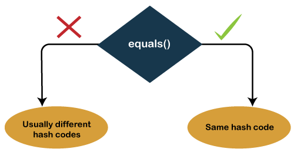

# 기본API클래스

## 목차
[1. java.lang](#1-javalang) </br>
[2. java.util](#2-javautil) </br>
[3. System](#3-system) </br>
[4. Class](#4-class) </br>
[5. String](#5-string) </br>
[6. StringBuffer, StringBuilder](#6-stringbuffer-stringbuilder)

___

## 1. java.lang
### 1.1 Object 클래스
클래스를 선언할 때 extends 키워드로 다른 클래스를 상속하지 않으면 암시적으로 java.lang.Object 클래스를 상속하게 된다. 따라서 자바의 모든 클래스는 Object 클래스의 자식이거나 자손 클래스이다.

#### 1.1.1 eqauls()
eqauls() 메소드의 매개 타입은 Object인데, 이것은 모든 객체가 매개값으로 대입될 수 있음을 말한다. 그 이유는 Object가 최상위 타입이므로 모든 객체는 Object 타입으로 자동 타입 변환될 수 있기 때문이다.

```java
Object obj1 = new Object();
Object obj2 = new Object();

boolean r1 = obj1.equals(obj2);
boolean r2 = (obj1 == obj2);

System.out.println(r1 && r2); // true
```

자바에서는 두 객체를 동등 비교할 때 equals() 메소드를 흔히 사용한다. equals()는 두 객체를 비교해서 논리적으로 동등하면 true를 리턴하고, 그렇지 않으면 false를 리턴한다.

논리적으로 동등하다는 것은 __같은 객체이건 다른 객체이건 상관없이 객체가 저장하고 있는 데이터가 동일함을 뜻한다.__

예를 들어 String 객체의 equals()는 String 객체의 번지를 비교하는 것이 아니고, 문자열이 동일한지 조사해서 같다면 true를, 다르면 false를 리턴한다. 이것이 가능한 이유는 String 클래스가 Object의 eqauls() 메소드를 오버라이딩해서 번지 비교가 아닌 문자열 비교로 변경했기 때문이다.

#### 1.1.2 hashCode()
객체 해시코드란 객체를 식별할 하나의 정수값을 말한다. Object의 hashCode() 메소드는 객체의 메모리 번지를 이용해서 해시코드를 만들어 리턴하기 때문에 객체마다 다른 값을 가지고 있다.

우선 hashCode() 메소드를 실행해서 리턴된 해시코드 값이 같은지를 본다. 해시코드 값이 다르면 다른 객체로 판단하고, 해시코드 값이 같으면 equals() 메소드로 다시 비교한다. 그렇기 때문에 hashCode() 메소드가 true가 나와도 equals()의 리턴값이 다르면 다른 객체가 된다.


> 출처 : https://www.javatpoint.com/equals-and-hashcode-in-java
___

## 2. java.util

___

## 3. System

___

## 4. Class

___

## 5. String

___

## 6. StringBuffer, StringBuilder

___

## 7. Arrays

___

## 8. Wrapper

___

## 9. Date, Calendar