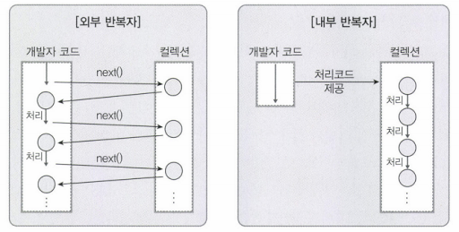

# 스트림

Stream은 자바 8부터 추가된 컬렉션의 저장 요소를 하나씩 참조해서 함수형 프로그래밍 방식으로 처리해줄 수 있도록 해주는 반복자이다.

___

## 반복자 스트림
자바 7이전까지는 List 컬렉션에서 요소를 순차적으로 처리하기 위해 Iterator 반복자를 사용했다.

```java
List<String> list = Arrays.asList("A", "B", "C");
Iterator<String> itr = list.iterator();

while(itr.hasNext()) {
    String alp = itr.next();
    System.out.println(alp);
}
```

위의 방식을 Stream으로 바꾸면 아래와 같다.

```java
List<String> list = Arrays.asList("A", "B", "C");
Stream<String> stream = list.stream();
stream.forEach(alp -> System.out.println(alp));
```

Collection의 stream 메소드로 스트림 객체를 얻은 후 forEach 메서드를 통해 컬렉션의 요소를 가져올 수 있다. forEach() 메소드는 다음과 같이 Consumer 함수형 인터페이스 타입의 매개값을 가지기 때문에 컬렉션의 요소를 소비할 코드를 람다식으로 표현할 수 있다.

```java
void forEach(Consumer<T> action)
```
___

## 스트림의 특징
1. __람다식으로 요소 처리__ </br>
stream이 제공하는 대부분의 메소드는 함수적 인터페이스 매개 타입을 가지기 때문에 람다식 또는 메소드 참조를 이용해서 요소 처리 내용을 매개값으로 전달할 수 있다.

2. __내부 반복자를 통한 병렬 처리__ </br>
__외부 반복자__ 란 개발자가 코드로 직접 컬렉션의 요소를 반복해서 가져오는 패턴을 말한다. for 또는 while 문이 일반적인 외부 반복자이다. </br></br>
반면 내부 반복자는 컬렉션 내부에서 요소들을 반복시키고, 개발자는 요소당 처리해야 할 로직만 제공해주면 되는 패턴이다.
</br></br>
또한 멀티 코어 CPU를 활용하여 요소들을 분배시켜 병렬 작업을 할 수 있게 도와주기 때문에 효율적으로 요소를 반복해서 처리할 수 있다. 병렬 처리란 한 가지 작업을 서브 작업으로 나누고, 서브 작업들을 분리된 스레드에서 병렬적으로 처리하는 것을 말한다.

3. __중간 처리 및 최종 처리__ </br>
스트림은 컬렉션의 요소에 대해 중간 처리와 최종 처리를 수행한다. 중간처리는 Mapping, Filtering, Sort를 수행하고 최종 처리에서는 반복, Counting, Average, Total SUm 같은 집계 처리를 수행한다.

___

## 스트림의 종류

|상위클래스|하위클래스|
|--|--|
|BaseStream|Stream<br>IntStream<br>LongStream<br>DoubleStream|

BaseStream 인터페이스는 모든 스트림에서 사용할 수 있는 공통 메소드들이 정의되어 있으며 실제로 사용하지는 않는다. 그 하위 클래스에는 실제로 사용하는 스트림으로 각각 기본 타입인 int, long, double 요소를 처리하는 스트림이다.

### __컬렉션으로부터 스트림 추출__
```java
Stream<Animal> stream = streaList.stream();
stream.forEach(s -> System.out.println(s.getName()));
```

### __배열로부터 스트림 추출__
```java
String[] arr = {"A", "B", "C"};
Stream<String> stream = Arrays.stream(arr);
stream.forEach(a -> System.out.println(a + ","));
```

### __숫자 범위로부터 스트림 추출__
```java
int sum = 0;
IntStream stream = IntStream.rangeClosed(1, 100);
stream.forEach(i -> sum+= i);
System.out.println(sum);
```

### __파일로부터 스트림 추출__
```java
Path path = Paths.get("/Users/DHL/Downloads/sample.txt");
Stream<String> stream = Files.lines(path, Charset.defaultCharset());
// s -> System.out.println(s) 와 동일
stream.forEach(System.out::println);
```

### __디렉터리로부터 스트림 추출__
```java
Stream<Path> stream = Files.list(path);
stream.forEach(p -> System.out.println(p.getFileName()));
```
___

## 스트림 파이프라인
스트림은 데이터의 필터링, 매핑, 정렬, 그룹핑 등의 중간 처리와 합계, 평균, 카운팅 등 최종 처리를 Pipeline 방식으로 처리한다. Pipeline은 여러 개의 스트림이 연결되어 있는 구조로, 최종 처리를 제외하고는 모두 중간 처리 스트림이 된다.

중간 스트림이 생성될 때 요소들이 바로 중간 처리되는 것이 아니라 __최종 처리가 시작되지 전까지 중간 처리는 Lazy 된다.__ 최종 처리가 시작되면 비로소 컬렉션의 요소가 하나씩 중간 스트림에서 처리되고 최종 처리까지 오게 된다.

```java
double avg = list.stream() // 원본 스트림
    .filter(i -> i.getType.eqauls("m")) // 중간 처리 스트림
    .mapToInt(IntList::getValue) // 중간 처리 스트림
    .average() // 최종 처리
    .getAsDouble();
```

### __필터링__
|리턴 타임|메소드|설명|
|--|--|--|
|Stream</br>IntStream</br>LongStream</br>DoubleStream</br>|distinct()</br>filter([Predicate]\|[IntPredicate]\|[LongPredicate]\[DoublePredicate])|중복 제거</br>조건필터링|

```java
List<String> alp = Arrays.asList("A", "B", "C", "D", "A");

// A B C D
alp.stream()
    .distinct()
    .forEach(a -> System.out.println(a));

// A A
alp.stream()
    .filter(a -> a.eqauls("A"))
    .forEach(a -> System.out.println(a));
```

### __매핑__
Mapping은 중간 처리 기능으로 스트림의 요소를 다른 요소로 대체하는 작업이다.

- FlatMapXXX() </br>
-> 요소를 대체하는 복수 개의 요소들로 구성된 새로운 스트림을 리턴

```java
// A B C D
List<String> list1 = Arrays.asList("A B", "C D");
lsit1.stream()
    .flatMap(s -> Arrays.stream(s.split(" ")))
    .forEach(s -> System.out.println(s));

// 1 2 3 4 5 6
List<String> list2 = Arrays.asList("1, 2, 3", "4, 5, 6");
list2.stream()
    .flatMapToInt(s -> {
        String[] strArr = data.split(",");
        int[] intArr = new int[strArr.length];
        for (int i = 0; i < strArr.length; i++) {
            intArr[i] = Integer.parseInt(strArr[i].trim());
        }

        return Arrays.stream(intArr);
    }).forEach(i -> System.out.println(i));
```

- mapXXX()</br>
-> 요소를 대체하는 요소로 구성된 새로운 스트림을 리턴

```java
List<Animal> AnimalList = Arrays.asList(
    new Animal("Cat", 10),
    new Animal("Dog", 15)
);

// 10 15
animalList.stream()
    .mapToInt(Animal::getWeight)
    .forEach(w -> System.out.println(w));
```