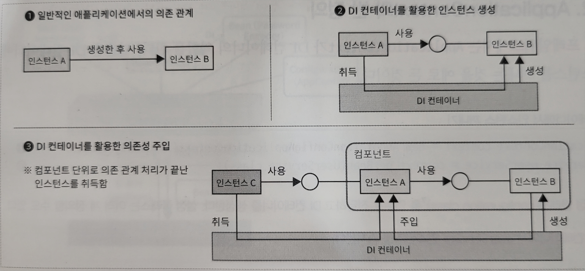
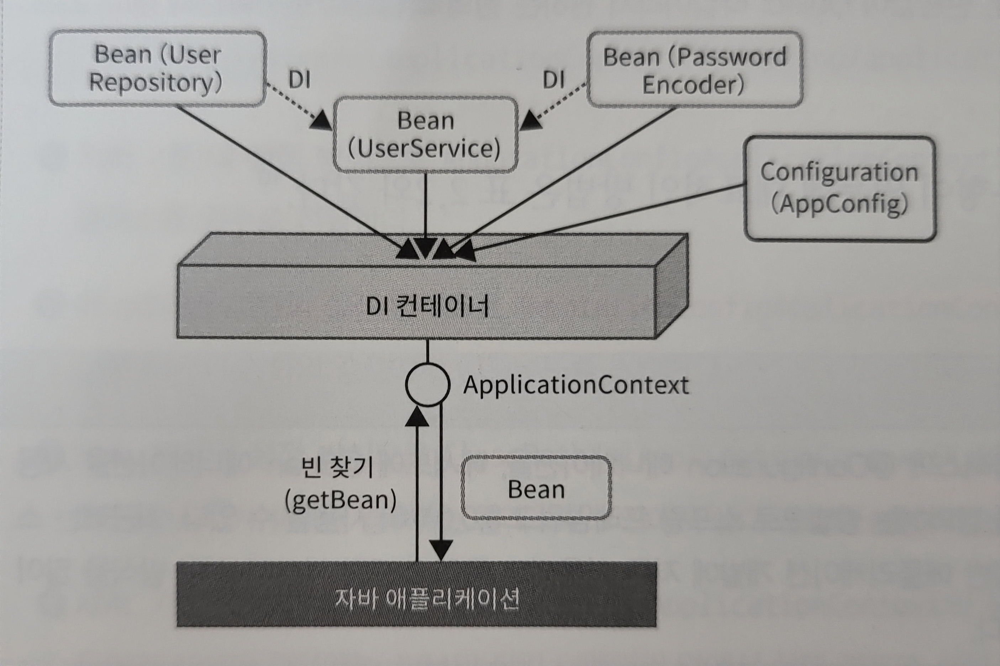

# DI 개요
DI는 의존성 주입이라고도 하며, IoC라고 하는 소프트웨어 디자인 패턴 중 하나다. 이때의 IoC는 __인스턴스를 제어하는 주도권이 역전된다는 의미__ 로, 컴포넌트를 구성하는 인스턴스의 생성과 의존 관계의 연결 처리를 해당 소스코드가 아닌 DI 컨테이너에서 대신해주기 때문에 제어가 역전됐다고 본다.</br>



DI 컨테이너에서 인스턴스를 관리하는 방식에는 다음과 같은 장점이 있다.
- 인스턴스의 스코프를 제어할 수 있다.
- 인스턴스의 생명 주기를 제어할 수 있다.
- AOP 방식으로 공통 기능을 집어넣을 수 있다.
- 의존하는 컴포넌트 간의 결합도를 낮춰서 단위 테스트하기 쉽다.

## __ApplicationContext와 빈 정의__
___
스프링 프레임워크에서는 ApplicationContext가 DI 컨테이너의 역할을 한다.

```java
ApplicationContext context = new AnnotationConfigApplicationContext(AppConfig.class); // (1)
UserService userService = context.getBean(UserService.class); // (2)
```

(1) : AppConfig 클래스를 인수로 전달하고 DI 컨테이너를 생성. </br>

(2) : DI 컨테이너에서 UserService 인스턴스를 가져온다.</br>

AppConfig 클래스는 DI 컨테이너에서 설정 파일 역할을 하며, 자바로 작성돼 있어서 자바 Configuration 클래스라고도 한다.

```java
@Configuration
public class AppConfig{
    @Bean
    UserRepository userRepository() {
        return new UserRepositoryImpl();
    }

    @Bean
    PasswordEncoder passwordEncoder() {
        return new BCryptPasswordEncoder();
    }

    @Bean
    UserService userService() {
        return new UserServiceImpl(userRepository(), passwordEncoder());
    }
}
```



@Configuration과 @Bean 애너테이션을 사용해 DI 컨테이너에 컴포넌트를 등록하면 애플리케이션은 DI 컨테이너에서 있는 Bean을 ApplicationContext 인스턴스를 통해 가져올 수 있다. 스프링 프레임워크에서는 __DI 컨테이너에 등록하는 컴포넌트를 Bean이라고 하고__ 해당 Bean에 대한 설정 정보를 'Bean Definition'라고 한다. DI컨테이너에서 Bean을 찾아오는 행위를 'Lookup'이라고 한다. </br>

Bean을 가져오는 방법은 아래와 같다.

```java
UserService userService = context.getBean(UserService.class) // (1)
UserService userService = context.getBean("userService", UserService.class); // (2)
UserService userService = (UserService) context.getBean("userService"); // (3)
```

(1) : 가져오려는 Bean 타입을 지정하는 방법. 지정한 타입에 해당하는 Bean이 DI 컨테이너에 오직 하나만 있을 때 사용. </br>

(2) : 가져오려는 Bean의 이름과 타입을 지정하는 방법. 지정한 타입에 해당하는 Bean이 DI 컨테이너에 여러 개 있을 때 이름으로 구분하기 위해 사용. </br>

(3) : 가져오려는 Bean의 이름을 지정하는 방법. 반환값이 Object 타입이라서 원하는 Bean 타입으로 형변환해서 사용. </br>

또한 추가적으로 아래와 같은 방법으로 Bean을 설정할 수 있다. </br>

|방법|설명|
|---|---|
|Java-based configuration|자바 클래스에서 @Configuration 애너테이션을, 메서드에 @Bean 애너테이션을 사용해 Bean을 정의한다.|
|XML-based configuration|XML파일을 사용하는 방법으로 \<bean\> 요소의 class 속성에 FQCN을 기술하면 Bean이 정의된다.|
|Annotation-based configuration|@Component 같은 Marker Annotation이 부여된 클래스를 탐색해서 DI 컨테이너에 Bean을 자동으로 등록한다.|

## __Bean 설정__
___
### __Java-based configuration__
```java
@Configuration // (1)
public class AppConfig() {
    
    @Bean // (2)
    UserRepository userRepository() {
        ...
    }

    @Bean
    PasswordEncoder passwordEncoder() {
        ...
    }

    @Bean // (3)
    UserService userService() {
        return new UserServiceImpl(userRepository(), passwordEncoder());
    }
}
```
(1) : 클래스에서 @Configuration 애너테이션을 붙여 설정 클래스를 선언한다. 설정 클래스는 여러 개 정의할 수 있다. </br>

(2) : 메서드에 @Bean 애너테이션을 부여해서 Bean을 정의한다. 메서드명이 Bean의 이름이 되고 그 Bean의 인스턴스가 반환값이 된다. 만약 Bean 이름을 다르게 명시하고 싶다면 @Bean(name="newName")과 같이 name 속성에 Bean 이름을 재정의한다. </br>

(3) : 다른 컴포넌트를 참조해야 할 때는 해당 컴포넌트의 메서드를 호출한다. 의존성 주입이 프로그램적인 방법으로 처리된다. </br>
___

### __XML-based configuration__
```XML
<?xml version="1.0" encoding="UTF-8"?>
<!-- (1) -->
<beans 
xmlns="http://www.springframework.org/schema/beans"
xmlns:xsi="http://www.w3.org/2001/XMLSchema-instance"       xsi:schemaLocation="http://www.springframework.org/schema/beans http://www.springframework.org/schema/beans/spring-beans.xsd">
    <!-- (2) -->
    <bean id="userRepository" class="com.example.demo.UserRepositoryImpl" />
    <bean id="passwordEncoder" class="com.example.demo.BCryptPasswordEncoder" />
    <!-- (3) -->
    <bean id="userService" class="com.example.demo.UserServiceImpl">
        <constructor-arg ref="userRepository" />
        <constructor-arg ref="passwordEncoder" />
    </bean>
</beans>
```
(1) : \<beans\> 요소 안에 Bean 정의를 여러 개 한다. </br>

(2) : \<bean\> 요소에 Bean 정의를 한다. id 속성에서 지정한 값이 Bean의 이름이 되고, class 속성에서 지정한 클래스가 해당 Bean의 구현 클래스가 된다. </br>

(3) : \<constructor-arg\> 요소에서 생성자를 활용한 의존성 주입을 할 수 있다. </br>

참고로 의존성 주입에서 주입할 대상이 다른 Bean이 아니라 특정 값인 경우, ref 속성을 사용하지 않고 value 속성을 사용한다.
```XML
<constructor-arg value="sample" />
```
___

### __애너테이션 기반 설정 방식__
DI 컨테이너에 관리할 Bean을 Bean설정 파일에 정의하는 대신 Bean을 정의하는 애너테이션을 클래스에 부여하는 방식을 사용한다. 이후 해당 애너테이션이 붙은 클래스를 탐색해서 DI 컨테이너에 자동으로 등록하는데, 이러한 탐색 과정을 __Component Scan__ 이라고 한다. 애너테이션이 붙어 있으면 DI 컨테이너가 자동으로 필요로 하는 의존 컴포넌트를 주입하게 된다. 이러한 주입 과정을 __Auto Wiring__ 이라 한다.
```Java
@Component // (1)
public class UserRepositoryImpl implements UserRepository {
    ...
}
```
```Java
@Component // (1)
public class BCryptPasswordEncoder implements PasswordEncoder {
    ...
}
```
```Java
@Component
public class UserServiceImpl implements userService {
    @Autowired // (2)
    public UserServiceImpl(UserRepository userRepository, PasswordEncoder passwordEncoder) {
        ...
    }
}
```
(1) : Bean 클래스에 @Component 애너테이션을 붙여 Component Scan이 되도록 한다. </br>

(2) : 생성자에 @Autowired 애너테이션을 부여해서 Autowiring되도록 만든다. Autowiring을 사용하면 기본적으로 주입 대상과 같은 타입의 Bean을 DI 컨테이너에서 찾아 대상에 주입하게 된다. </br>

컴포넌트 스캔을 수행할 때는 스캔할 범위를 지정해야 한다.
```Java
@Configuration
@ComponentScan("com.example.demo") // (1)
public class AppConfig() {
    ...
}
```
(1) : 컨포넌트 스캔이 활성화되도록 클래스에 @ComponentScan 애너테이션을 부여한다. value 속성이나 basePackages 속성에 컴포넌트를 스캔할 패키지를 지정한다. </br>

XML-based configuration에서 Component Scan을 할 땐 아래와 같이 한다.
```XML
<?xml version="1.0" encoding="UTF-8"?>
<beans 
xmlns="http://www.springframework.org/schema/beans"
xmlns:xsi="http://www.w3.org/2001/XMLSchema-instance"       xsi:schemaLocation="http://www.springframework.org/schema/beans http://www.springframework.org/schema/beans/spring-beans.xsd">
    <context:component-scan base-package="com.example.demo" /> <!-- (1) -->
</beans>
```
(1) : \<context:component-scan\> 요소의 base-package 속성에 컴포넌트를 스캔할 패키지를 지정한다. 
___
> __출처 : 스프링 철저 입문 (위키북스)__