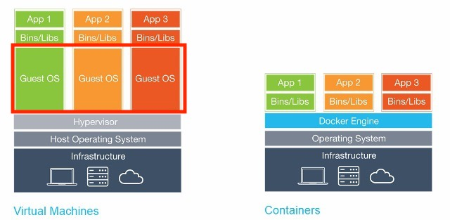

# 컨테이너의 이해

## 컨테이너를 사용하는 이유
__1. 인프라의 사용률 향상__
- 하나의 물리 서버나 가상 서버 위에서 여러 개의 컨테이너를 돌릴 수 있다.
- CPU와 메모리 사용률을 높여 하드웨어를 효율적으로 이용할 수 있다.

__2. 빠른 기동 시간__
- 컨테이너의 기동 시간은 가상 서버나 물리 서버의 기동 시간보다 훨씬 빠르다.
- 운영체제, 애플리케이션, 미들웨어 등 다양한 이미지를 쉽게 얻을 수 있다.
- 설치 작업이나 설정 작업이 줄어든다.

__3. 불변 실행 환경__
- 애플리케이션 실행에 필요한 소프트웨어를 모두 포함하여 컨테이너를 작성할 수 있다.
- 컨테이너를 조합하여 시스템을 구성함으로써 특정 서버 환경에 대한 종속성을 배제할 수 있다.

___

## 가상 서버와 컨테이너의 차이점

> 출처 : https://velog.io/@kdaeyeop/%EB%8F%84%EC%BB%A4-Docker-%EC%99%80-VM%EC%9D%98-%EC%B0%A8%EC%9D%B4

가상 서버는 가상화 소프트웨어를 사용하여 하드웨어를 공유하는 형태로, 마치 한 대의 전용 서버가 있는 것처럼 이용할 수 있게 해준다. 한 대의 머신에서도 여러 대의 가상 서버를 가동할 수 있어 하드웨어 구입이나 설치 관리 비용을 줄일 수 있다.

이러한 가상화 소프트웨어를 __Hypervisor__ 라 부르며, VMware, Xen, KVM, VirtualBox, Hyper-V와 같이 상용 제품부터 오픈 소스까지 제품이 다양한다.

> __Hypervisor?__  
  각 OS마다 수행되는 명령을 하드웨어가 이해할 수 있게 하나의 명령어로 변역해주는 역할

컨테이너는 __하나의 리눅스 프로세스가 마치 전용 서버에서 동작하고 있는 것 같은 분리 상태__ 를 만들어 낸다. 이는 리눅스 커널의 __네임스페이스__ 와 __컨트롤 그룹(cgroup)__ 이라는 기술을 기반으로 한다.

결론적으로 컨테이너는 Guest OS를 설치하지 않고 Hypervisor를 사용하지 않는다. 이러한 특징으로 인하여 자원의 효율성이 크게 차이가 나게된다. 또한 Guest OS는 사용하기 위한 라이브러리, 커널 등을 전부 포함하기 때문에 이미지 크기가 큰 반면 컨테이너는 필요한 패키지만 가지고 있기 때문에 이미지 크기가 상대적으로 작다.

> __네임스페이스?__  
프로세스별 리소스 사용을 분리하는 것으로 이름이 다른 공간을 만들어 프로세스를 분리한다.  
즉, 프로세스에 대한 환경을 격리한다.

> __cgroup?__  
프로세스별 가용 컴퓨팅 자원(Memory, CPU, Device, I/O)을 제어하는 것.

___

## 도커의 아키텍처

> 출처 : https://docs.docker.com/get-started/overview/

도커는 소프트웨어 개발자가 컨테이너를 이용해 개발 생산성을 높일 수 있도록 컨테이너를 Build(작성), Ship(이동), Run(수행)할 수 있는 기능을 지원한다. 이러한 기능을 제공하는 도커는 __도커 데몬 서버__ 와 클라이언트인 __도커 커맨드__, 그리고 이미지의 보관소인 __레지스트리__ 로 구성된다.

- __도커 데몬__  
도커 데몬은 클라이언트인 도커 커맨드의 명령을 받아들여서 도커 오브젝트인 이미지, 컨테이너, 볼륨, 네트워크 등을 관리한다. 추가적으로 네트워크 연결을 통해 원격 클라이언트로부터 요청을 받을 수 있다.

- __도커 클라이언트__  
도커 커맨드는 컨테이너를 조작하는 커맨드 라인 유저 인터페이스로 도커 데몬의 클라이언트다. 도커 커맨드는 도커 API를 사용하여 도커 데몬에 요청을 보낸다.

1. docker build : 베이스 이미지에 기능을 추가하여 새로운 이미지를 만들 때 사용한다.
2. docker poll : 레지스트리에서 이미지를 로컬에 다운로드할 때 사용한다.
3. docker run : 이미지를 바탕으로 컨테이너를 실행한다.

### 이미지
이미지는 읽기 전용인 컨테이너의 템플릿을 말한다. 컨테이너를 기동하기 위한 실행 파일과 설정 파일의 묶음이라고 볼 수 있다. 컨테이너를 실행하면 이미지에 담긴 미들웨어나 애플리케이션이 설정에 따라 기동한다. 이미지는 여러 개의 계층으로 된 바이너리 파일로 존재하고, 컨테이너를 생성하고 실행할 때 읽기 전용으로 사용된다.

### 컨테이너
컨테이너는 하나의 프로세스라고 볼 수 있다. 즉, 리눅스의 네임스페이스나 cgroup을 통해 다른 프로세스들과 완전히 분리되어 실행되는 프로세스인 것이다. 컨테이너는 이미지를 읽기 전용으로 사용하되 이미지에서 변경된 사항만 컨테이너 계층에 저장하므로 컨테이너에서 무엇을 하든지 원래 이미지는 영향을 받지 않는다.

각 컨테이너는 각기 독립된 파일시스템을 제공받으며 호스트와 분리돼 있으므로 특정 컨테이너에서 어떤 애플리케이션을 설치하거나 삭제해도 다른 컨테이너와 호스트는 변화가 없다.

컨테이너는 OS커널이 격리된 사용자 공간을 제공하는 서버 가상화 기법이라고도 한다. 따라서 애플리케이션과 그 구동환경을 격리한 공간이라 볼 수 있다.

### 레지스트리
도커 레지스트리는 컨테이너의 이미지가 보관되는 곳이다. 도커는 기본적으로 Docker Hub에 있는 이미지를 찾도록 설정되어 있다.

___

## 도커와 쿠버네티스의 연동

>출처 : https://kubernetes.io/blog/2018/05/24/kubernetes-containerd-integration-goes-ga/

쿠버네티스는 도커를 컨테이너의 런타임 환경으로 사용한다. 쿠버네티스를 설치할 때 제일 먼저 도커를 설치해야 하는 것도 이 때문이다.

containerd는 다양한 플랫폼 위에서 동작하는 업계 표준 코어 컨테이너 런타임으로 간결하고 높은 이식성을 목표로 개발되었다. containerd는 Docker CE 17.3에서 버전 0.2.3이 도입되었고, Docker CE17.12에서는 1.1이 되었다. 이를 통해 이미지 보관 및 전송, 컨테이너 실행, 볼륨과 네트워크 연결과 같은 컨테이너의 라이프 사이클을 호스트에서 관리할 수 있게 되었다.

containerd는 버전 1.1부터는 CRI(Container Runtime Interface)에 대응하여 네이티브 kublet도 연동할 수 있게 되었다.

> 참조 : 15단계로 배우는 도커와 쿠버네티스