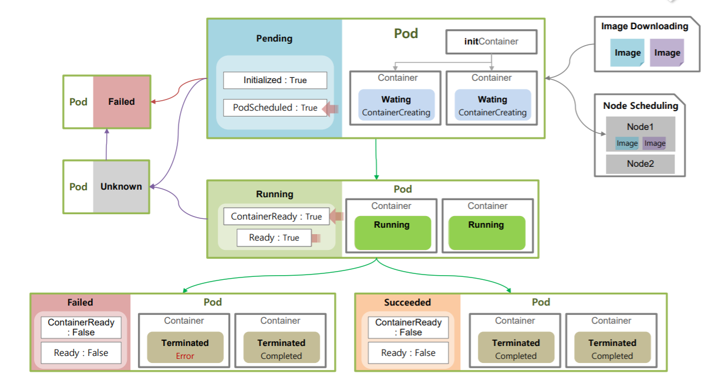
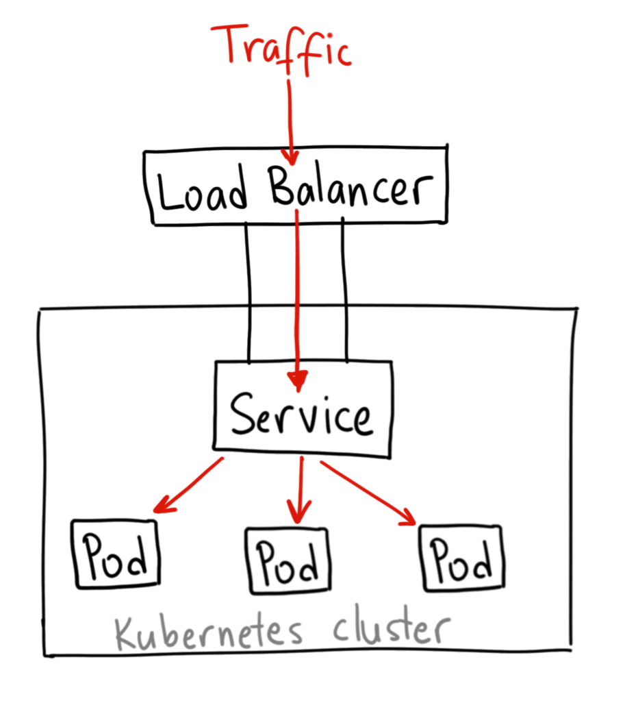
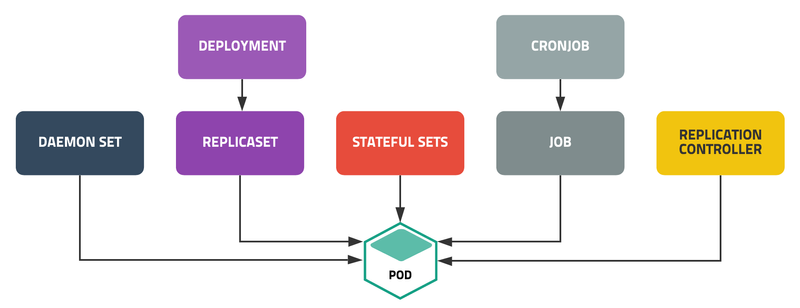

# 쿠버네티스의 기본

## 아키텍처


|구성요소|개요|
|--|--|
|kubectl|k8s 클러스터를 조작하기 위한 도구로 커맨드 라인 인터페이스로 제공|
|kube-apiserver|kubectl 등의 API 클라이언트로부터 오는 REST 요청을 검증하고, API 오브젝트를 구성하고 상태를 보고|
|kube-scheduler|생성된 모든 파드에 대해 실행할 최적의 노드를 선택하는 k8s의 기본 스케쥴러|
|kube-controller-manager|컨트롤러를 구동하는 마스터상의 컴포넌트|
|cloud-controller-manager|API를 통해서 클라우드 서비스와 연계하는 컨트롤러|
|etcd|k8s 클러스터의 모든 관리 데이터를 Key/Value 형태로 저장하는 저장소|
|kubelet|각 노드에서 실행되며 파드와 컨테이너의 실행, API 서버에 상태 보고, 컨테이너의 동작을 확인하는 프로브 실행을 하는 역할|
|kube-proxy|각 노드에서 실행되며 로드밸런싱 기능을 제공|
|coredns|파드가 서비스 이름으로부터 IP 이름으로부터 IP 주소를 얻기 위해 사용|

## etcd
etcd는 Nodes, Pods, Configs, Secrets, Accounts, Roles 등 다양한 쿠버네티스 오브젝트를 저장하는 Key-Values 저장소이다. </br>
쿠버네티스 클러스터에 변화를 줄 때마다 etcd 저장소는 업데이트 된다.

## kube-apiserver
kubectl 등의 API 클라이언트로부터 오는 REST 요청을 검증하고, API 오브젝트를 구성하고 상태를 보고한다. </br>
kubectl 명령어를 수행하게되면 kube-apiserver로 요청을 하게 되고 유저 검증 과정을 처리한다. 이후 명령어에 대한 검증작업을 거친 후 etcd로부터 데이터를 조회하고 오브젝트 정보를 저장한다. 저장된 정보를 etcd가 가지고 있다가 scheduler가 업데이트 되지 않은 오브젝트를 처리하게 된다. 배포되는 서버의 kubelet은 해당 파드를 배포 후 kube-apiserver로 돌아온 다음에 etcd에 처리 결과 상태를 업데이트한다.</br>
즉, kube-apiserver는 각종 인증, 수행, scheduler 등 처리에 대한 엔드포인트라 생각하면 된다.

## kube-controller-manager
컨트롤러를 구동하는 마스터상의 컴포넌트이다. controller manager 각 노드의 상태를 점검하고 즉각적인 상황에 대한 처리를 수행하게 된다. 컨트롤러는  Node-Controller, Replication-Controleller, Deployment-Controller 등이 존재하는데 이러한 전체적인 컨트롤러들을 관리하게 된다.

## kube-scheduler
kube-scheduler는 생성된 모든 파드에 대해 실행할 최적의 노드를 선택하는 역할을 한다. 파드는 생성해야할 리소스 나 조건이 서로 다를 수 있다. 스케쥴러는 해당 파드가 수행에 적합한 Node를 찾고 배포하게 된다. 이때 타겟 노드를 선택하기 위해 리소스 사용에 따라서 노드를 '필터링' 후 우선순위가 높은 Node를 찾을 후 해당 노드에 배포하게 된다.

## kube-proxy
쿠버네티스안에서는 많은 Pod들이 서로 연결될 수 있는데 이를 위해 Pod-Networking이 형성된다. Pod-Networkig구조를 가지기 위해 쿠버네티스는 모든 노드에 Kube-proxy를 배포하게 된다. Pod-Networking은 가상IP로 구성되어 있으며 각 Pod는 이 가상IP를 할당받는다. Pod가 IP나 DNS로 통신을 하려고 할 때 Kube-proxy를 이용하게 된다.
___

## 쿠버네티스 API 오프젝트
쿠버네티스에 대한 조작은 모두 API를 통해 이뤄진다. kubectl은 마스터 노드상의 kube-apiserver에게 쿠버네티스 API 규약에 맞게 기술된 목표 상태 선언서인 매니페스트를 YAML 형식 혹은 JSON 형식으로 전송하여 오브젝트를 수정하는 일을 한다.

### __오브젝트(Object)__
오브젝트란 k8s 클러스터 내부의 엔티티로서 Pod, Controller, Service 등이 인스턴스를 의미한다. 각각의 오브젝트는 쿠버네티스 API의 리소스 종류에 맞게 설정되고 생성된다.

각 오브젝트는 메타데이터에 기술된 이름에 의해 식별된다. 따라서 오브젝트를 만들 떄는 반드시 __이름__ 을 부여해야 한다. 같은 종류의 오브젝트의 이름은 하나의 __Namespace__ 에서 반드시 유일해야 한다. Namespace는 k8s 클러스터를 논리적으로 분할하여 사용하기 위해 존재하는 기능이다.

### __워크로드(Workload)__
워크로드란 오브젝트의 __카테고리__ 를 나타내는 용어로 __Container와 Pod, 그리고 Controller의 그룹__ 을 의미한다.

### __파드(Pod)__
파드는 컨테이너를 실행하기 위한 단일 오브젝트이다. 파드는 한 개 혹은 여러 개의 컨테이너를 담을 수 있다. 규모를 크게 하기 위해서는 Pod를 더 배포를 하거나 규모를 줄이기 위해서는 Pod를 제거해야한다. </br>
```shell
# kubectl Command
$ kubectl run nginx --image nginx

# Get pods list
$ kubectl get pods 
```
Pod는 YAML파일을 바탕으로도 생성이 가능하다. 루트 레벨의 속성으로 'apiVersion', 'kind', 'metadata', 'spec'이 존재하며 해당 속성은 필수이다.
```yaml
# pod-definition.yaml
apiVersion: v1
kind: Pod
metadata:
  name: myapp-pod
  # 일종의 kubernetes object Dictionary
  # kubernetes Object를 구분하는데 사용되는 key-value의 쌍으로 서로 동일한 그룹으로 묶기 위해서는 labels이 각 오브젝트마다 동일해야한다.
  labels:
    app: myapp
    type: front-end
spec:
  # List / Array
  # Dash(-)는 리스트를 의미
  containers:
  - name: nginx-container
    image: nginx
```
```shell
$ kubectl apply -f pod-definition.yaml
```

### __컨테이너(Container)__
쿠버네티스에서 컨테이너만을 독자적으로 실행하는 것을 불가능하고, 반드시 파드 내에서 실행해야 한다.

### __컨트롤러(Controller)__
컨트롤러는 파드의 실행을 제어하는 오브젝트이다. 컨트롤러는 종류가 여러개 있기 때문에 각 역할에 맞춰서 사용해야 한다.

### __설정(Configuraion)__
컨테이너 내 애플리케이션의 설정값을 저장할 수 있는 ConfigMap으로, 네임스페이스에 저장된 정보는 컨테이너 내의 파일이나 환경 변수를 통해 애플리케이션에서 참조할 수 있다.

### __서비스(Service)__
서비스는 파드와 클라이언트를 연결하는 역할을 수행한다. 서버 역할을 수행하는 파드가 클라이언트의 요청을 받을 수 있도록 대표 IP 주소를 취득하여 내부 DNS에 등록한다. 그리고 대표 IP 주소로의 요청 트래픽을 지정된 파드들에 부하분산하며 전송하는 역할도 수행한다.

### __스토리지(Storage)__
파드나 컨테이너는 실행 시에만 존재하는 일시적인 존재이기 떄문에 중요한 데이터를 컨테이너의 파일 시스템에 저장해서는 안 된다. 데이터를 잃지 않기 위해서는 퍼시스턴트 볼륨을 사용하여 전원이 꺼져도 데이터가 유지되는 스토리지 시스템에 데이터를 저장해야 한다.

다만 퍼시스턴트 볼륨은 쿠버네티스의 범위에 포함되지 않기 때문에 외부 스토리지 시스템을 연동해야 하는데, 이때 다양한 외부 스토리지 시스템의 프로토콜과 API의 차이점을 은폐하기 위해 쿠버네티스는 스토리지를 계층적으로 추상화한 오브젝트를 제공한다.

___

## 파드의 기본
파드는 쿠버네티스에서 컨테이너를 실행하는 최소 단위로 한 개 혹은 여러 개의 컨테이너를 포함한다. 하나의 파드에 속하는 모든 컨테이너들은 같은 노드에서 동작한다. 

### 파드의 특징
- 파드 내부의 컨테이너들은 파드의 IP 주소와 포트번호를 공유한다.
- 파드의 내부 컨테이너들은 localhost로 서로 통신할 수 있다.
- 파드의 내부 컨테이너들은 System V 프로세스 통신이나 POSIX 공유 메모리를 사용하여 서로 통신할 수 있다.
- 파드의 내부 컨테이너들은 파드의 볼륨을 마운트하여 파일 시스템을 공유할 수 있다.

### __일시적인 존재__
파드는 __일시적 존재로 설계되어__ 파드 내의 컨테이너는 이미지로부터 매번 생성된다. 즉, 같은 오브젝트 이름으로 몇 번이고 파드를 기동해도 이전에 컨테이너에서 수행한 변경 이력은 남지 않고, 이미지의 초기 상태에서 시작한다.

또한, 파드의 IP 주소도 고정적이지 않다. 파드의 IP 주소는 기동 시 부여되고, 종료 시에 회수되어 다른 파드가 기동할 때 사용된다. 따라서 파드에 요청을 보내고 싶은 경우에는 반드시 __서비스__ 를 사용해야 한다.

### __실행 상태 관리__
파드가 정지한 경우에는 담당 __컨트롤러__ 가 재기동 등의 정해진 처리를 수행하는 한편, 파드 내부의 컨테이너가 정지한 경우에는 파드가 해당 컨테이너를 재시작한다.

또한 파드는 Liveness Probe와 Readiness Probe를 설정하여 내부 애플리케이션의 상태를 감시할 수 있다. 예를들어 Liveness Probe를 설정하면 애플리케이션이 멈춰 있는 상태를 감지하여 __컨테이너를 강제 종류__ 시킬 수 있다. 반면, Readiness Probe를 설정하면, 파드가 요청을 받을 준비가 될 때까지 서비스 오브젝트가 요청을 전송하지 않는다.

### __초기화 전용 컨테이너__
파드에 초기화만을 담당하는 컨테이너를 설정할 수 있다. 그러면 파드가 기동된 후 초기화 담당 컨테이너가 제일 먼저 실행되며 초기화가 끝나면 핵심 기능을 수행하는 컨테이너들이 실행된다.

___

## 파드의 Life Cycle
쿠버네티스의 트러블 슈팅 중 가장 많이 발생하는 것이 파드의 기동 실패 원인 분석이다. 개인의 개발 환경에서 컨테이너 이미지를 빌드하고 쿠버네티스 환경에 배포했을 때 제일 먼저 경험하는 것이 컨테이너가 기동하지 않거나 재시작을 반복하는 현상이다. 이러한 이유로 파드의 상태가 가지는 의미를 파악 후 적절하게 대처할 수 있어야 한다.

문제를 파악하기 위해서는 'kubectl get pods'를 실행했을 때 나타나는 STATUS 열의 정보가 중요하다.


|STATUS|의미와 대책|
|--|--|
|ContianerCreating|이미지를 다운로드 중이거나 컨테이너를 생성하는 중에 있다. __ConfigMap과 Secret이 마운트 되지 않아 컨테이너 생성이 보류된 경우일 수도 있다.__
|CrashLoopBackOff|파드 내의 컨테이너가 종료되어 다음 기동 시까지 대기 상태에 있음을 의미한다. 2회 이상 컨테이너가 종료되면, CrashLoopBackOff 시간 동안 대기하게 된다. __컨테이너 내의 프로세스를 검토할 필요가 있다.__|
|Pending|파드 생성 요구를 받았지만 하나 이상의 컨테이너가 생성되지 않은 상태를 의미한다. __리소스 부족 등의 이유로 스케쥴이 되지 않은 경우에 해당한다.__|
|Running|파드의 모든 컨테이너가 생성되어 실행 중임을 의미한다.|
|Terminating|컨테이너에 종료 요청 시그널을 보낸 후 컨테이너가 종료할 때까지 대기 중임을 의미한다. 유예 시간을 넘겨도 컨테이너가 종료할 수 없는 경우는, 컨테이너를 강제로 종료한다.|
|Succeeded|파드 내 모든 컨테이너가 정상적으로 종료했음을 의미한다.|
|Completed|파드 내 컨테이너가 정상적으로 종료되었음을 의미한다. 파드 내의 복수개의 컨테이너가 있는 경우, 첫 번째 컨테이너가 정상 종료(Exit Code == 0)하면 표시된다.|
|Error|컨테이너가 이상 종료된 경우다. Exit 코드가 0이 아닌 경우에 이상 종료로 간주한다. 파드 내의 복수개의 컨테이너가 있는 경우, 첫 번째 컨테이너가 이상 종료(Exit Code != 0)하면 표시된다.|
|Failed|파드 내에 적어도 하나의 컨테이너가 이상 종료했음을 의미한다.|
|Unknown|파드의 상태를 얻을 수 없는 상황을 의미한다.|

## 파드의 종료 처리
쿠버네티스는 종료 요청 시그널을 받은 컨테이너의 애플리케이션이 일정 시간 내에 종료 처리를 완료하고 정상 종료를 하도록 요구한다.

예를 들어, 쿠버네티스에는 롤아웃이라는 기능이 있는데, 운영 중인 애플리케이션을 가동 중에 업데이트하는 기능이다. 이 기능을 담당하는 컨트롤러는 가동중인 애플리케이션에 종료 요청 시그널을 보내고 유예 시간까지 파드의 종료를 기다린다. 만약, 유예 시간 내에 종료되지 않으면 강제로 종료된다.

애플리케이션이 동작 중에 강제로 종료되면, 데이터 분실 등의 장애로 이어질 수 있다. 따라서, 애플리케이션은 유예 시간 내에 메모리상의 데이터를 퍼시스턴트 볼륨에 보존하거나 데이터베이스와의 세션을 종료하는 등의 종료 처리를 수행해야 한다.

### __종료 처리의 흐름__
1. 사용자가 kubectl delete pod를 실행하면 파드의 종료 처리가 시작된다. 기본 유예 시간은 30초다.
2. kubectl get pod의 status는 Terminating이 된다.
3. 파드의 PreStop hook이 정의되어 있으면, 파드 내에서 호출된다. 유예 시간을 넘어서면 PreStep hook이 실행되고 있어도, 파드 내의 메인 프로세스에 SIGTERM이 보내지며, 2초 후에 강제 종료 된다.</br>
PreStop hook이 정의되어 있지 않다면, 곧바로 파드 내의 메인 프로세스에 SIGTERM신호가 송신되며 종료 처리가 개시 된다.</br>
파드가 서비스의 엔드포인트 목록에서 제거되며, 로드밸런서(kube-proxy 등)의 목록에서도 제거된다.
4. 유예 시간을 넘어서서 파드 내의 프로세스가 살아 있다면, 파드의 메인 프로세스에 SIGKILL을 보내서 강제로 종료된다.
5. 제거 대상인 파드가 표시되지 않는다.

## 클러스터 네트워크
클러스터 네트워크는 k8s 클러스터 내부에서 사용되는 네트워크다. 파드는 이 네트워크상의 IP 주소를 부여받아 다른 노드에 있는 파드와 서로 통신한다.

서비스의 IP 주소나 포트번호를 k8s 클러스터 외부 네트워크에서 접근할 수 있게 하려면, 서비스 타입을 NodePort 혹은 LoadBalancer로 설정하거나 인그레스를 함께 사용하면 된다.

### __애드온__
- Flannel </br>
간단한 L3네트워크를 노드 간에 구축한다. 각 노드 위에 서브넷을 구성해서 한 노드 위의 파드가 다른 노드 위의 파드랑 통신할 수 있도록 한다. Flannel의 파드는 데몬셋 컨트롤러에 의해 배포된다. 따라서 k8s 클러스터에 새로운 노드가 추가되면 자동적으로 파드 네트워크가 확장된다. 다만 네트워킹 기능만을 갖추고 있으며, 접근 제어 기능은 제공하지 않는다.
> __L3 스위치__ </br>
L3 스위치는 서로 다른 네트워크 간의 연결이 가능한 것으로 포트간 패킷 스위칭을 위해 패킷의 IP나 IPX 주소를 읽어서 스위칭을 하며, 통신 경로를 한 번만 설정한다. 해당 프로토콜을 쓰는 패킷에 대해 스위칭이 가능하며, IP나 IPX 주소가 OSI 7 계층 중 3 계층에 해당하기 때문에 레이어 3 스위치라고 한다. </br></br>
참조 : http://wiki.hash.kr/index.php/L3_%EC%8A%A4%EC%9C%84%EC%B9%98

- Calico </br>
노드 간 파드 통신에 대해 네트워크 접근 제어 기능을 제공한다. 예를 들면, 2개의 네임스페이스간에 통신을 금지하는 접근 제어 기능을 설정할 수 있다.

## 서비스의 기본


쿠버네티스의 서비스는 클라이언트의 요청을 파드에 전달하는 역할을 담당한다. 이러한 서비스가 필요한 이유는 파드의 IP주소가 기동할 떄마다 바뀌기 때문이다. 그래서 파드에 접속해야하는 클라이언트는 서비스가 가지는 대표 IP를 사용해서 접속해야 한다.

서비스는 Pod의 로드밸런서의 역할을 가지며, 클라이언트의 요청을 받기 위한 대표 IP 주소를 획득한다. 서비스의 이름은 내부 DNS에 등록되기 떄문에 클라이언트는 서비스의 __이름__ 만으로 서비스의 IP주소를 획득할 수 있다. 이후 서비스는 실렉터에 지정된 Label과 일치하는 파드 중 하나에게 요청을 전달한다.

파드는 기동될 때 라벨이나 IP 주소를 포함한 자신의 오브젝트 정보를 마스터 노드의 etcd에 등록한다. 그래서 서비스의 전송처를 결정할 때 실렉터의 Label에 일치하는 파드를 __etcd__ 에서 조회하여 전송할 파드의 IP주소를 취득한다.

__이처럼 Label에 의해 대상 오브젝트를 결정하는 것이 쿠버네티스의 기본적인 동작이다.__

## 컨트롤러의 기본


컨트롤러는 파드를 제어한다. 파드에게 부여할 워크로드의 타입, 즉 처리에 따라서 적절한 컨트롤러를 선택해야 한다.

### __워크로드 타입__
- __프런트엔드 처리__</br>
스마트폰, IoT기기, 컴퓨터 등의 클라이언트로부터 요청을 직접 받아들이는 워크로드를 총칭한다. 이 타입의 워크로드는 대량의 클러이언트 요청에 대해 짧은 시간에 응답을 반환하는 것이 중요하다.</br>
이러한 워크로드 특성에 대응하기 위해서는 요청에 대응하는 처리를 복수의 파드에서 분담하도록 설계해야 한다. 또한, 24시간 무정지로 서비스를 제공하면서도 빠르게 신기능을 배포할 수 있어야 한다.

- __백엔드 처리__</br>
백엔드 처리는 프런트엔드의 뒤에서 업무 특성에 맞게 대응할 수 있는 유연성이 있어야 한다. 이를테면, 요청량이 변하더라도 일정한 응답 속도를 유지해야 한다.

- __배치 처리__</br>
배치 처리는 어떤 트리거에 의해 실행이 개시된다. 예를 들면, 프런트엔드로부터의 요청, 정해진 시간, 단말로부터의 수시 요청 등에 의해 개시된다.

- __시스템 운영 처리__</br>
시스템 운영을 돕기 위해 쿠버네티스 API를 사용해서 노드에서 발생하는 에러나 하드웨어 이상을 감지하고 자동으로 대책을 실행하는 파드를 만드는 경우도 있다.

### __컨트롤러의 타입__
- __Deployment__</br>
대등한 관계에 있는 여러 개의 파드로 수평한 클러스터를 구성할 떄 사용한다. 정해진 개수만큼 파드가 가동하도록 관리하며, 가동 중인 파드를 차례대로 교체하거나 규모를 조절할 수 있는 기능을 갖추고 있다.

- __StatefulSet__</br>
파드와 퍼시스턴트 볼륨을 조합하여 데이터의 보관에 초점을 둔 컨트롤러다. 파드와 퍼시스턴트 볼륨에 번호를 매겨 관리함으로써 본질적으로 일시적인 존재인 파드가 상태를 가지는 워크로드를 처리할 수 있도록 해준다.

- __Job__</br>
배치 처리를 하는 컨테이너가 정상 종료할 때까지 재실행을 반복하는 컨트롤러다. 파드 실행 횟수, 동시 실행수, 실행 횟수의 상한을 설정할 수 있으며, 지워질 때까지 로그를 보존한다. 데이터 처리나 과학 분야의 계산 작업 등에 사용된다.

- __CronJob__</br>
지정한 시각에 정기적으로 Job을 생성한다. Job을 실행 완료한 파드를 몇 개까지 보관할 수 있는지 설정할 수 있어, 정기적으로 실행되어야 하는 배치 처리에 적합하다.

- __DaemonSet__</br>
k8s 클러스터의 모든 노드에서 같은 파드를 실행하기 위해 존재한다. 예를 들면, 클러스터 네트워크를 구성하는 파드는 데몬셋에 의해 모든 노드에서 실행되며, 새로운 노드가 추가되면 해당 노드에서 자동으로 실행된다. 시스템 운영의 자동화에 적합하다.

- __ReplicaSet__</br>
디플로이먼트 컨트롤러와 연동해서 파드가 기동되어야 하는 수를 관리한다. 레플리카셋은 직접 다루기보다는 디플로이먼트를 통해 이용하는 것이 기본이다.

> 참조 : 15단계로 배우는 도커와 쿠버네티스