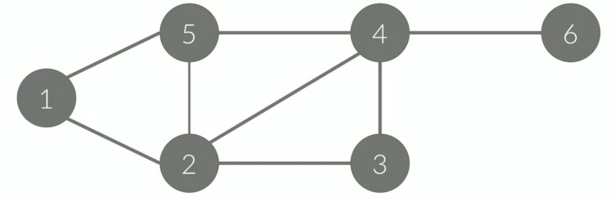
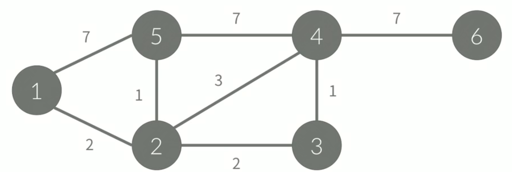

# 그래프

- 정점(Node, Vertex) : 어떠한 점을 나타낸다.
- 간선(Edge) : 정점간의 관계를 나타낸다.
- G = (V, E)로 나타낸다.

경로란 정점 A에서 B로 가는것을 말하며 정점간의 간선을 통해서만 이동이 가능하다.  
사이클이란 __시작 종점 == 도착 정점__ 이 된다.

- __단순 경로, 단순 사이클__ : 경로/사이클에서 같은 정점을 두 번 이상 방문하지 않는다.  특별한 말이 없으면, 일반적으로 사용하는 경로와 사이클은 단순 경로/사이클을 말한다.

- __가중치(Weight)__ : 간선에 가중치가 있는 경우.   A에서 B로 이동하는 거리, 이동하는데 필요한 시간, 이동하는데 필요한 비용이 될 수 있다. 만약 가중치가 없는 경우에는 1이라고 생각하면 된다.

- __차수(Degree)__ : 정점과 연결되어 있는 간선의 개수이다. 방향 그래프의 경우에는 In-degree, Out-degree로 나누어서 표현한다.  
C의 In-degree : 1  
C의 Out-degree : 2

## 그래프의 표현

위의 그래프는 정점이 6개 간선이 8개가 존재하는 그래프이다.
- 정점 : {1, 2, 3, 4, 5, 6}
- 간선 : {(1,2), (1,5), (2, 5), (2, 3), (2, 4), (3, 4), (4, 5), (4, 6)}

간선의 저장에서 효율성을 보장하기 위해서는 __한 정점 V와 연결된 모든 정점을 구하는 시간__ 이 최적화가 되어야한다.

효울성을 보장하면서 구현하는 방법은 아래와 같다.
1. 인정 행렬 (2차원 행렬)
2. 인접리스트 (리스트)

### __인접 행렬__
정점의 개수를 V라고 했을 때 V x V크기의 이차원 배열을 이용한다.  
A[i][j] = 1 (i -> J 간선이 있을 때), 0(이동할 수 있는 간선이 없을 때)

||1|2|3|4|5|6|
|--|--|--|--|--|--|--|
|1|0|1|0|0|1|0|
|2|1|0|1|1|1|0|
|3|0|1|0|1|0|0|
|4|0|1|1|0|1|1|
|5|1|1|0|1|0|0|
|6|0|0|0|1|0|0|

만약 가중치 그래프일 경우 배열에 간선의 가중치 값을 저장한다.  
A[i][j] = 1 (i -> J 간선이 있을 때, 그 가중치), 0(이동할 수 있는 간선이 없을 때)

인접 행렬에서 __필요한 공간은 V^2이 되며(이차원 배열)__ , __탐색 효율성은 V__ 만큼 된다. 정점 3(A[3][j])의 값 중 j번째 위치한 값을 찾기 위해서는 j만큼의 탐색을 해야하기 때문이다.

인접행렬의 장점은 임의의 두 정점 사이에 간선이 있는지 없는지를 쉽게 판단할 수 있다.  
인접행렬의 문제는 많은 공간(V^2)를 사용하기 때문에 메모리를 많이 차지하게 된다.

### __인접 리스트__
그래프를 구현할 때 기본적으로 사용하며 List를 이용하여 구현할 수 있다.  
A[i] = i와 연결된 정점을 리스트로 포함하고 있다. List 내부에는 정점을 저장하고 있다.

- A[1] = {2, 5}
- A[2] = {1, 5, 4, 3}
- A[3] = {2, 4}
- A[4] = {5, 2, 3, 6}
- A[5] = {1, 2, 4}
- A[6] = {4}

결국 __공간은 E(Edge)__ 만큼 필요하게 되며, __효율성은 O(정점의 차수)__ 만큼 걸리게 된다.

리스트는 크기가 동적으로 변경할 수 있어야 하기때문에 Java에서는 ArrayList를 주로 사용한다. 가중치 그래프의 경우에는 아래와 같이 표현할 수 있다.

- A[1] = {(2,2), (5,7)}
- A[2] = {(1,2), (5,1), (4,3), (3,2)}
- A[3] = {(2,2), (4,1)}
- A[4] = {(5,7), (2,3), (3,1), (6,7)}
- A[5] = {(1,7), (2,1), (4,7)}
- A[6] = {(4,7)}

### __간선 리스트__
배열을 이용해서 구하며, 간선을 모두 저장하고 있다. E라는 배열에 간선을 모두 저장한다.

E[0] = 1 2  
E[1] = 1 5  
E[2] = 2 1  
E[3] = 2 3  
E[4] = 2 4  
E[5] = 2 5  
E[6] = 3 2  
E[7] = 3 4  
E[8] = 4 2  
E[9] = 4 3  
E[10] = 4 5  
E[11] = 4 6  
E[12] = 5 1  
E[13] = 5 2  
E[14] = 5 4  
E[15] = 6 4  

> 참조 : https://www.acmicpc.net/problem/13023
> 참조 : 백준 - 코딩 테스트 준비