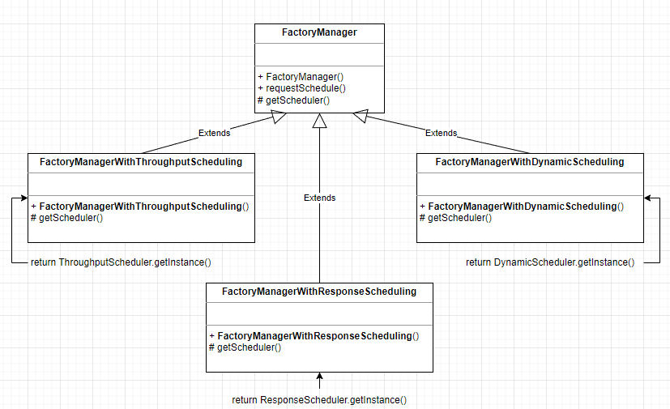
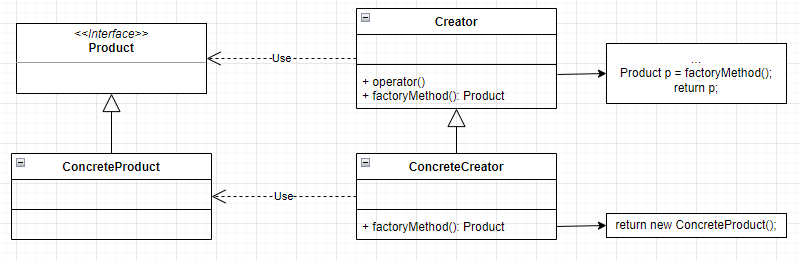

# 팩토리 매서드 패턴
팩토리 메서드 패턴(Factory Method Pattern)은 객체의 __생성__ 코드를 __별도의 클래스/메서드__ 로 분리함으로써 객체 생성의 변화에 대비하는 데 유용하다.

특정 기능은 상황에 따라 변경될 수 있으며, 특정 기능의 구현은 개별 클래스를 통해 제공되는 것이 바람직한 설계다. 따라서 기능의 변경이나 상황에 따른 기능의 선택은 바로 해당 객체를 생성하는 코드의 변경을 초래한다. 또한 상황에 따라 적절한 객체를 생성하는 코드는 중복될 수 있다.

이러한 경우에 객체 생성 코드를 별도의 클래스/메서드로 분리해 사용하면 해당 클래스/메서드만 변경함으로써 객체 생성 방식의 변화에 효과적으로 대응할 수 있다.

예를 들어 여러 개의 클래스에서 필요에 따라 클래스 Sample1의 객체와 클래스 Sample2의 객체를 생성해 사용한다고 했을 때, Sample1과 Sample2를 생성하는 방식이 달라지거나 Sample3와 같이 새로운 클래스의 객체를 생성하는 경우에는 __생성부의 모든 코드를 수정해야 한다.__

```java
class TestA {
    // 공통 부분
    void function() {
        Sample sample;

        if (...) {
            sample = new Sample1();
        } else {
            sample = new Sample2();
        }

        ...
    }
}

...

class TestZ {
    // 공통 부분
    void function() {
        Sample sample;

        if (...) {
            sample = new Sample1();
        } else {
            sample = new Sample2();
        }

        ...
    }
}
```

하지만 팩토리 메서드 패턴을 사용하면 객체 생성 기능을 제공하는 Factory 클래스를 정의하고 이를 활용하는 방식으로 설계할 수 있다.

```java
class SampleFactory() {
    static Sample get(...) {
        Sample sample;

        if (...) {
            sample = new Sample1();
        } else {
            sample = new Sample2();
        }

        return sample;
    }
}

class TestA {
    void function() {
        Sample sample = SampleFactory.get(...);

        ...
    }
}

...

class TestA {
    void function() {
        Sample sample = SampleFactory.get(...);

        ...
    }
}
```

이럴경우 Sample1과 Sample2의 생성 방식이 변경되거나 Sample2를 추가해야 할 때 SampleFactory 클래스만 변경하고 기존 클래스들은 변경할 필요가 없다.

__즉, 팩토리 메서드 패턴은 객체를 생성하는 코드를 별도의 클래스/메서드로 분리함으로써 객체 생성 방식의 변화에 대비하는 데 유용하다.__

또한 객체 생성을 전담하는 별도의 클래스를 두는 대신 하위 클래스에서 적합한 클래스의 객체를 생성하는 방식으로도 처리할 수 있다. 예를 들어, 공장 스케쥴을 처리하는 SchedulerFactory는 처리량, 최소 대기 시간, 동적 선택 방식을 선택할 수 있다고 하자. 이때 각 스케쥴 객체를 생성하지 않고 __해당 스케쥴링 전략에 따라 스케쥴을 선택하는 클래스를__ FactoryManager 클래스의 하위 클래스로 정의할 수 있다.



FactoryManager 클래스는 아직 구체적인 스케쥴링 전략이 결정되지 않았기에 getScheduler 메서드를 추상 메서드로 정의한다. 하위 클래스에서는 getScheduler 메서드를 오버라이드하여 구체적인 스케쥴링 전략 객체를 생성하도록 한다.

```java
public abstract class FactoryManager {
    
    protected abstract FactoryScheduler getScheduler();

    void requestScheduler() {
        FactoryScheduler scheduler = getScheduler();
        scheduler.doRun();
    }

}
```

```java
public class FactoryManagerWithThroughputScheduling extends FactoryManager {
    
    @Override
    protected FactoryScheduler getScheduler() {
        FactoryScheduler scheduler = ThroughputScheduler.getInstance();
        return scheduler;
    }
}

public class FactoryManagerWithResponseTimeScheduling extends FactoryManager {
    
    @Override
    protected FactoryScheduler getScheduler() {
        FactoryScheduler scheduler = ResponseTimeScheduler.getInstance();
        return scheduler;
    }
}

public class FactoryManagerWithDynamicScheduling extends FactoryManager {
    
    @Override
    protected FactoryScheduler getScheduler() {
        int hour = Calendar.getInstance().get(Calendar.HOUR_OF_DAY);
        FactoryScheduler scheduler = null;

        if (hour < 12) {
            scheduler = ResponseTimeScheduler.getInstance();
        } else {
            scheduler = ThroughputScheduler.getInstance();
        }

        return scheduler;
    }
}
```

FactoryManager의 requestScheduler 메서드는 getScheduler 메서드를 추상 메서드로 정의하고 FactoryManager의 하위 클래스는 getScheduler 메서드를 오버라이드 하는 방식으로 설계되었다. 이때 getScheduler 메서드는 스케줄링 전략 객체를 생성하는 기능을 제공하므로 __팩토리 메서드__ 라고 한다.

이와 같이 상속 관계를 이용해 팩토리 메서드 패턴을 설계하는 경우, 팩토리 메서드를 이용해 구체적인 클래스의 객체를 생성하는 기능은 일반적으로 하위 클래스에서 오버라이드되게 한다.



|Class|설명|
|--|--|
|Product|팩토리 메서드로 생성될 객체의 공통 인터페이스|
|ConcreteProduct|구체적으로 객체가 생성되는 클래스|
|Creator|팩토리 메서드를 갖는 클래스|
|ConcreteCreator|팩토리 메서드를 구현하는 클래스로 ConcreteProduct 객체를 생성|

> 참고 : Java 객체 지향 디자인 패턴 (한빛 미디어)