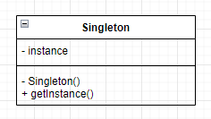

# 싱글톤

싱글턴 패턴은 인스턴스가 오직 하나만 생성되는 것을 보장하고 어디에서든 인스턴스에 접근할 수 있도록 하는 디자인 패턴이다.



__하나의 인스턴스만을 생성하는 책임이 있으므로 getInstance 메서드를 통해 모든 클라이언트에게 동일한 인스턴스를 반환할 수 있어야 한다.__

예를들어 프린터를 관리하는 프로그램을 만든다고하자.
프린트라는 자원은 하나만을 사용하고 여러사용자가 공유해서 사용한다.

```java
public class Printer {
    public Printer() {}

    ...
}
```

이때 Printer 클래스를 여러사용자가 공유해서 사용하려면 객체가 반드시 한 번만 생성되어야 한다.

이를위해 생성자를 외부에서 호출할 수 없도록 private으로 선언할 수 있다.

```java
public class Printer {
    private Printer() {}

    ...
}
```

외부에서는 객체를 생성할 수 없으므로 코드 내부에서 인스턴스를 만들어 외부에 제공할 수 있도록 해야한다.

```java
public class Printer {
    private static Printer printer = null;
    private Printer() {}

    public static Printer getPrinter() {
        return printer = (printer == null) ? new Printer() : printer;
    }

    ...
}
```
위의 코드에서 주의 깊게 봐야 할 점은 getPrinter 메서드와 printer 변수가 __static__
 타입으로 선언되어있다는 점이다. static으로 선언된 메서드나 변수는 정적 변수이기 때문에 클래스 자체에 속하게 된다. __즉, 클래스의 인스턴스를 통하지 않고서도 메서드를 실행할 수 있고 변수를 참조할 수 있다.__

```java
import java.util.ArrayList;
import java.util.List;

class User {
	private String name;
	
	public User(String name) {
		this.name = name;
	}
	
	public void print() {
		Printer printer = Printer.getPrinter();
		printer.print(this.name + " : " + printer.toString());
	}
}

class Printer {
	private static Printer printer = null;
	private Printer() {}
	
	public static Printer getPrinter() {
		return printer = (printer == null) ? new Printer() : printer;
	}
	
	public void print(String str) {
		System.out.println(str);
	}
}

public class Main {
	public static void main(String[] args) {
		List<User> user = new ArrayList<>();
		for (int i = 1; i <= 5; i++) {
			user.add(new User("User" + i));
		}
		
		user.forEach(u -> u.print());
	}
}
```

결과는 아래와 같으며 프린터 객체 하나만 사용하는것을 볼 수 있다.

```shell
User1 : com.pattern.singleton.Printer@1218025c
User2 : com.pattern.singleton.Printer@1218025c
User3 : com.pattern.singleton.Printer@1218025c
User4 : com.pattern.singleton.Printer@1218025c
User5 : com.pattern.singleton.Printer@1218025c
```

## 문제점
위의 코드는 __다중 스레드__ 완경에서 문제가 발생될 수 있다.

getPrinter()를 호출할 때 printer는 처음에 null인 상태이므로 여러 스레드가 동시에 접근할 경우 Printer 객체가 여러개가 생성될 수 있다.

현재 Printer에서는 공용으로 사용하는 상태값이 없어 큰 문제가 없지만 아래와 같이 되어있을 경우 문제가 발생될 수 있다.
> Printer 객체가 동시에 생성된다는 가정을 하기위해 중간에 Thread.sleep을 통해 상태를 잠시 멈추게한다.

```java
import java.util.ArrayList;
import java.util.List;

class UserThread extends Thread {
	public UserThread(String name) {
		super(name);
	}

	@Override
	public void run() {
		Printer printer = Printer.getPrinter();
		printer.print(Thread.currentThread().getName() + " : " + printer.toString());
	}
	
}

class Printer {
	private static Printer printer = null;
    private int counter = 0; // Printer 상태값
    private Printer() { }

    public static Printer getPrinter() {
        if (printer == null) {
            try {
                Thread.sleep(100);
            } catch (Exception e) {
                e.printStackTrace();
            }

            printer  = new Printer();
        }

        return printer;
    }

    public void print(String str) {
        counter++;
        System.out.println(str + " " + counter);
    }
}

public class Main {
	public static void main(String[] args) {
		List<UserThread> user = new ArrayList<>();
		for (int i = 1; i <= 5; i++) {
			user.add(new UserThread("User" + i));
		}
		
		user.forEach(u -> u.start());
	}
}
```
```shell
User3 : com.pattern.singleton.Printer@5b992ba 1
User2 : com.pattern.singleton.Printer@2d255a9c 3
User5 : com.pattern.singleton.Printer@2d255a9c 3
User1 : com.pattern.singleton.Printer@5d1f5ebc 1
User4 : com.pattern.singleton.Printer@2d255a9c 3
```

이는 Printer 클래스의 인스턴스가 상태를 유지하기 떄문에 counter 변가 난잡하게 출력될 수 있다.

## 해결책
### __1. 정적 변수에 인스턴스를 만들어 초기화하는 방법__
```java
public class Printer {
	private static Printer printer = new Printer();
	private int counter = 0;
	private Printer() { }

	...
}
```
정적 변수는 객체가 생성되기 전 클래스가 Memory에 로딩될 때 만들어져 초기화가 한 번만 실행된다. __즉, 정적 변수는 프로그램이 시작될 때부터 종료될 때까지 없어지지 않고 Memory에 계속 상주하여 클래스에서 생성된 모든 객체에 참조할 수 있다.__

### __2. 인스턴스를 만드는 메서드에 동기화__
```java
public class Printer {
	private static Printer printer = null;
	private int counter = 0;
	private Printer() { }

	public synchronized static Printer getPrinter() {
		return printer = (printer == null) ? new Printer() : printer;
	}

	public void print(String str) {
		synchronized(this) { // 오직 하나의 스레드만 접근 허용
			counter++;
			System.out.println(str + " : " + counter);
		}
	}
}
```
synchronized 키워드를 사용하여 스레드 동기화를시켜 동시에 접근하는것을 막도록 한다.

```shell
User5 : com.pattern.singleton.Printer@3f2dc342 : 1
User1 : com.pattern.singleton.Printer@3f2dc342 : 2
User4 : com.pattern.singleton.Printer@3f2dc342 : 3
User3 : com.pattern.singleton.Printer@3f2dc342 : 4
User2 : com.pattern.singleton.Printer@3f2dc342 : 5
```

## 싱글턴 패턴과 정적 클래스
실제로 싱글턴 패턴을 사용하지 않고 __정적 메서드__ 로만 이루어진 정적 클래스를 사용해도 동일한 효과를 얻을 수 있다.

```java
public class Printer {
	private static int counter = 0;
	public synchronized static void print(String str) {
		counter++;
		System.out.println(str + " : " + counter);
	}
}

public class UserThread extends Thread {
	public UserThread(String name) {
		super(name);
	} 

	@Override
	public void run() {
		Printer.print(Thread.currentThread().getName());
	}
}

public class Main {
	public static void main(String[] args) {
		List<UserThread> user = new ArrayList<>();
		for (int i = 1; i <= 5; i++) {
			user.add(new UserThread("User" + i));
		}
		
		user.forEach(u -> u.start());
	}
}
```
```shell
User3 : 1
User4 : 2
User1 : 3
User5 : 4
User2 : 5
```

정적 클래스를 이용하는 방법과 싱글턴 패턴을 이용하는 방법의 가장 큰 차이점은 __객체를 생성하지 않고 메서드를 사용한다는 점이다.__ 또한 정적 메서드를 사용하므로 일반적으로 실행할 때 Binding(컴파일 타입에 바인딩되는 작업) 인스턴스 메서드를 사용하는 것보다 성능 면에서 우수하다.

> 정적 바인딩 : Runtime 이전에 값이 확정 </br>
동적 바인딩 : Runtime 이후에 값이 확정 </br></br>
정적 바인딩이 효율이 좋은 이유는 컴파일 시 이미 값이 확정되어있어 실행만 하면 된다. 컴파일러는 선언되어있는 자료형을 바로 바인딩하기 때문에 객체가 무엇이든 __포인터의 자료형을 기반으로__ 호출대상을 결정하기에 동적 바인딩보다 속도가 빠르다.

그러나 정적 클래스를 사용할 수 없는 경우가 있는데, 대표적인 경우가 __인터페이스__ 를 구현해야 하는 경우다. 정적 메서드는 인터페이스에서 사용할 수 없다.

```java
public interface Printer {
	public static void print(String str); // 사용 불가

	// 인터페이스 내에서 구현하는것은 상관없음
	static void print(String str) {
		...
	}
}
```

> 참고 : Java 객체 지향 디자인 패턴 (한빛 미디어)