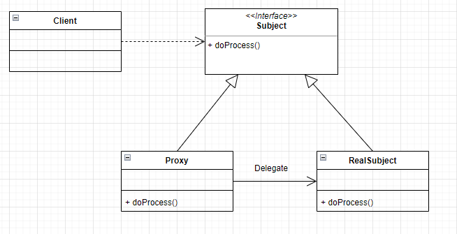

# Proxy 패턴

- Proxy는 대리자, 대변인의 의미를 가진다.
- 즉, 대신해서 그 역할을 수행한다.
- 객체로 표현하자면 실제 기능을 수행하는 객체대신, 가상의 객체를 사용해 제어한다.
- 객체를 직접적으로 참조하는 것이 아닌, 해당 객체를 대신하는 객체를 통해 대상에게 접근한다.
- 실제 객체가 메모리에 존재하지 않아도 기본적인 정보를 참고하거나 설정이 가능하다.
- 필요한 시점까지 객체의 생성을 미룰 수 있어 메모리를 절약할 수 있다.



프록시는 아래와 같은 역할을 수행한다.
1. Proxy는 인터페이스를 통해 실제 서비스와 같은 이름의 메소드를 구현한다.
2. Proxy는 실제 서비스와 동일한 이름을 가진 메소드를 호출하고 클라이언트에게 돌려준다.
3. Proxy는 실제 서비스의 메소드 호출 전,후에도 별도의 수행을 처리할 수 있다.
4. Proxy는 __흐름제어만 수행 할 뿐 결과 값을 조작하거나 변경해서는 안 된다.__

## __장점__
- 사이즈가 큰 객체가 로딩되기 전에 Proxy를 통해 참조할 수 있다.
- 실제 객체가 수행하는 동작을 캡슐화 시키고 인터페이스 메소드를 통해 노출시킨다.
- DB 쿼리 수행 및 대용량 파일 처리와 같은 비용이 많이 드는 연산을 실제로 필요한 시점에 수행할 수 있다.

## __단점__
- 객체를 생성할 중간 처리 작업을 거치게 되어 성능이 저하될 수 있다.
- 로직이 복잡해져서 가독성이 떨어질 수 있다.

## __종류__
1. Virtual Proxy : 실제 객체의 참조가 이뤄지기전까지 객체의 생성을 미루고, 해당 객체가 생성된 것 처럼 동작하도록하는 Proxy 패턴이다. 작은 단위의 작업을 처리하고 리소스가 많이 요구되는 작업이 필요할 경우 실제 클래스를 사용한다.

2. Protection Proxy : 실제 클래스에 대한 접근을 제어하기 위해 사용되며 객체에 대한 접근 권한을 제어하고 싶을 때 사용된다. Proxy 클래스에서 클라이언트가 실제 클래스에 대한 접근을 허용할지에 대해 결정한다.

### __Virtual Proxy__
예를들어 객체 초기화가 오래걸리는 클래스가 존재한다고하자. 해당 객체를 지속적으로 생성할 경우 작업시간이 오래 걸리기 때문에, Proxy 객체는 레퍼런스만 갖도록하고 실제 객체에 대한 수행 요청이 올 경우 Proxy가 원본 객체를 실제로 접근하도록 한다.

```java
public interface Printable {

	public void print(String str);
	public void setPrintName(String name);
	public String getPrintName();
	
}
```
```java
public class Printer implements Printable {

	private String name;
	
	public Printer() {
		this.loading();
	}
	
	@Override
	public void print(String str) {
		System.out.println("- Current User : name");
		System.out.println("- Print Value : " + str);
	}

	@Override
	public void setPrintName(String name) {
		this.name = name;
	}

	@Override
	public String getPrintName() {
		return this.name;
	}

	private void loading() {
		System.out.println("Printer Loading...");
		for (int i = 0; i < 5; i++) {
			try {
				Thread.sleep(1000);
				System.out.print(".");
			} catch (Exception e) {
				e.printStackTrace();
			}
		}
		System.out.println("");
		System.out.println("Printer Loading Success.");
	}
	
}
```
```java
public class ProxyPrinter implements Printable {

	private String name;
	private Printer realObject; // Printer 멤버를 가지고 있지만 Printer를 처음부터 초기화하지 않는다.
	
	@Override
	public void print(String str) {
		this.delegate(); // 실제 객체에 접근이 필요하여 수행할 때 Lazy Initialize
		this.realObject.print(str);
	}

	@Override
	public synchronized void setPrintName(String name) {
		if (realObject != null) {
			// 실제 객체에도 설정.
			realObject.setPrintName(name);
		}
		this.name = name;
	}

	@Override
	public String getPrintName() {
		return this.name;
	}

	private synchronized void delegate() {
		if (realObject == null) {
			realObject = new Printer();
		}
	}
	
}
```
```java
public class Main {

	public static void main(String[] args) {
		Printable printer = new ProxyPrinter();
		printer.setPrintName("Cat");
		System.out.println("Current User : " + printer.getPrintName());
		printer.setPrintName("Dog");
		System.out.println("Current User : " + printer.getPrintName());
		printer.print("Hello Cat?");
	}
	
}
```
프록시 클래스인 ProxyPrinter를 사용함으로써 기존 Printer클래스를 대신 사용하여 수행시간이 오래걸리는 초기화 작업을 넘기고 대신 수행한다. 실제 클래스에 접근이 필요할 경우에 객체 생성 후 작업을 수행할 수 있다.