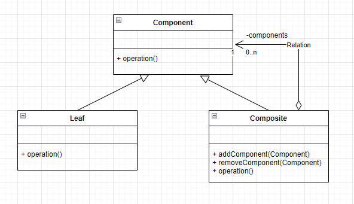
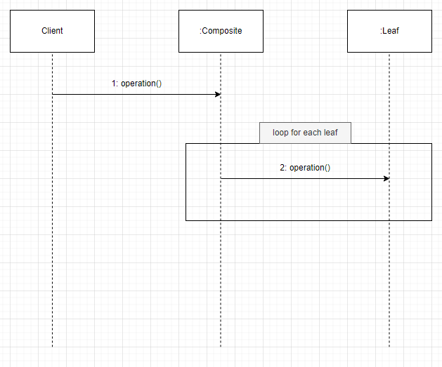
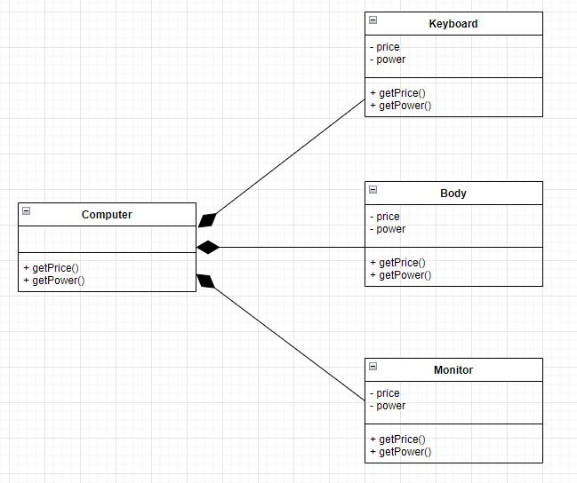
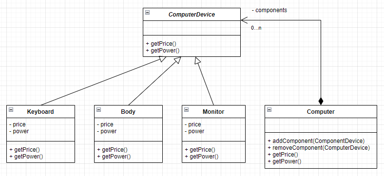

# 컴포지트 패턴
- 부분-전체의 관계를 갖는 객체들을 정의할 때 유용.
- 부분 객체의 추가나 삭제 등이 있어도 전체 객체의 클래스 코드를 변경하지 않음.
- 클라이언트는 전체와 부분을 구분하지 않고 동일한 인터페이스를 사용 가능.


> 클래스 다이어그램에서 마름모가 표시된 클래스는 전체의 의미가 되고, 반대쪽 클래스는 부분이 된다.

|객체|설명|
|--|--|
|Component|구체적인 부분으로 Leaf 클래스와 전체에 해당하는 Composite 클래스에 공통 인터페이스를 정의|
|Leaf|구체적인 부분 클래스로 Composite 객체의 부품으로 설정|
|Composite|전체 클래스로 복수 개의 Component를 갖도록 정의. 복수 개의 Leaf, 복수 개의 Composite 객체를 부분으로 가질 수 있음|


- Client는 Composite 객체에 operation 메서드를 호출.
- Composite 객체는 안에 포함되어 있는 각 Leaf 객체에 동일한 operation 메서드를 호출

## 구현
예를들어, 컴퓨터를 모델링한다고 하자. 컴퓨터는 키보드, 본체, 모니터를 가질 수 있다. </br>
Computer 객체는 Keyboard객체, Body객체, Monitor객체를 구현할 수 있다.

또한 컴퓨터의 가격(price)과 전력 소비량(power)를 계산하는데 필요한 속성과 연산이 있다. 그리고 키보드, 본체, 모니터 같은 부품은 자신의 가격과 전력 소비량을 속성으로서 갖는다.



```java
public class Keyboard {
    private int price;
    private int power;

    public Keyboard(int power, int price) {
        this.power = power;
        this.price = price;
    }

    public int getPrice() {
        return price;
    }

    public int getPower() {
        return power;
    }
}

// Keyboard와 동일
public class Body {
    ...
}

// Keyboard와 동일
public class Monitor {
    ...
}

public class Computer {
    private Body body;
    private Keyboard keyboard;
    private Monitor monitor;

    public void addBody(Body body) {
        this.body = body;
    }

    public void addKeyboard(Keyboard keyboard) {
        this.keyboard = keyboard;
    }

    public void addMonitor(Monitor monitor) {
        this.monitor = monitor;
    }

    public int getPrice() {
        return body.getPrice() + keyboard.getPrice() + monitor.getPrice();
    }

    public int getPower() {
        return body.getPower() + keyboard.getPower() + monitor.getPower();
    }
}
```
아래는 클라이언트에서 실제로 객체를 생성하는 단계이다.

```java
public class Client {
    public static void main(String[] args) {
        Body body = new Body(500000, 70);
        Keyboard keyboard = new Keyboard(80000, 2);
        Monitor monitor = new Monitor(200000, 30);
        
        Computer computer = new Computer();
        computer.addBody(body);
        computer.addKeyboard(keyboard);
        computer.addMonitor(monitor);

        System.out.println("Total Price : " + computer.getPrice());
        System.out.println("Total Power : " + computer.getPower());
    }
}
```
```shell
Total Price : 780000
Total Power : 102
```

## 문제점
- 만약 Computer의 부품이 새로 추가가 된다면?
- Computer 클래스는 새롭게 추가되는 부품을 지원할 수 있도록 확장이 필요하다.
- 결국 Computer객체는 새로운 부품에 대한 참조가 늘어나게되고 필드가 추가가 되어야 한다.
- 공통 사용 메서드에 대한 기능도 새롭게 수정되어야 한다. (getPrice, getPower)

즉, 클래스 코드 수정이 늘어나게되어 확장성이 좋지 않게된다.

## 해결책

- Computer가 가질 수 있는 부품을 일반화해 ComputerDevice라는 클래스를 정의한다.
- ComputerDevice는 Keyboard, Body, Monitor 등 구체적인 부품 클래스의 공통 기능만 가지며 실제로 존재하는 구체적인 부품이 될 수 없다.
- ComputerDevice 객체를 실제로 생성할 수 없도록하기 위해서 추상 클래스가 되어야 한다.
- Computer 클래스는 복수 개(0...n)의 ComputerDevice를 가질 수 있다.
- 또한 Computer 클래스도 ComputerDevice 클래스의 하위 클래스로 정의한다. 따라서 ComputerDevice 클래스를 이용하여 클라이언트는 Body, Keboard 등과 동일한 방식으로 Computer를 사용할 수 있다.
- 이때 Computer는 Composite의 역할을 하며, Keyboard, Body, Monitor는 Leaf가 된다.

```java
public abstract class ComputerDevice {
    public abstract int getPrice();
    public abstract int getPower();
}

public class Keyboard extends ComputerDevice {
    private int price;
    private int power;

    public Keyboard(int power, int price) {
        this.power = power;
        this.price = price;
    }

    @Override
    public int getPrice() {
        return price;
    }

    @Override
    public int getPower() {
        return power;
    }
}

// Keyboard와 동일
public class Body {
    ...
}

// Keyboard와 동일
public class Monitor {
    ...
}
```
아래는 부품들을 가지는 Computer 객체이다.

```java
public class Computer extends ComputerDevice {

    // 복수 개의 ComputerDevice를 가질 수 있다.
    private List<ComputerDevice> components;

    public Computer() {
        this.components = new ArrayList<>();
    }

    // 각 컴포넌트에 대한 전용 메서드가 아닌 공통 ComputerType을 통해 컴포넌트 추가가 가능
    public void addComponent(ComputerDevice component) {
        components.add(component);
    }

    public void removeComponent(ComputerDevice component) {
        components.remove(component);
    }

    @Override
    public int getPrice() {
        int price = 0;
        for (ComputerDevice component : components) {
            price += component.getPrice();
        }

        return price;
    }

    @Override
    public int getPower() {
        int power = 0;
        for (ComputerDevice component : components) {
            power += component.getPower();
        }

        return power;
    }
}
```

아래는 클라이언트에서 실제로 객체를 생성하는 단계이다.

```java
public class Client {
    public static void main(String[] args) {
        Body body = new Body(500000, 70);
        Keyboard keyboard = new Keyboard(80000, 2);
        Monitor monitor = new Monitor(200000, 30);

        Computer computer = new Computer();
        computer.add(body);
        computer.add(keyboard);
        computer.add(monitor);

        System.out.println("Total Price : " + computer.getPrice());
        System.out.println("Total Power : " + computer.getPower());
    }
}
```
```shell
Total Price : 780000
Total Power : 102
```

이때 만약 Speaker객체가 추가가 된다면 어떻게 될까? Speaker도 동일하게 ComputerDevice를 상속받고 Computer객체에 add만 시켜주기만하면 자동으로 가격과 전력량을 구할 수 있게 된다.

```java
public class Speaker extends ComputerDevice {
    private int price;
    private int power;

    public Speaker(int power, int price) {
        this.power = power;
        this.price = price;
    }

    @Override
    public int getPrice() {
        return price;
    }

    @Override
    public int getPower() {
        return power;
    }
}
```
```java
public class Client {
    public static void main(String[] args) {
        Body body = new Body(500000, 70);
        Keyboard keyboard = new Keyboard(80000, 2);
        Monitor monitor = new Monitor(200000, 30);
        Speaker speaker = new Speaker(150000, 10); // 새로 추가된 Speaker

        Computer computer = new Computer();
        computer.add(body);
        computer.add(keyboard);
        computer.add(monitor);
        computer.add(speaker); // Computer에 추가

        System.out.println("Total Price : " + computer.getPrice());
        System.out.println("Total Power : " + computer.getPower());
    }
}
```
```shell
Total Price : 930000
Total Power : 112
```
> 참고 : Java 객체 지향 디자인 패턴 (한빛 미디어)