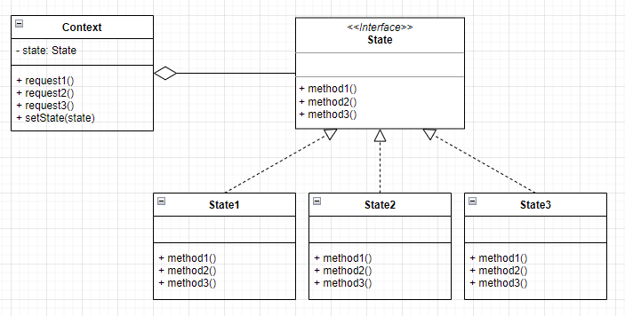
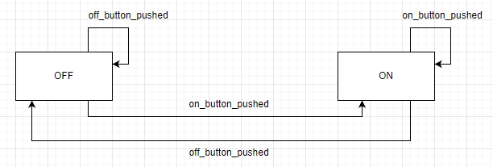
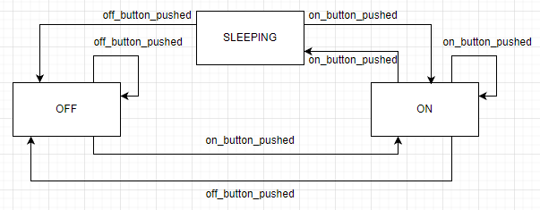
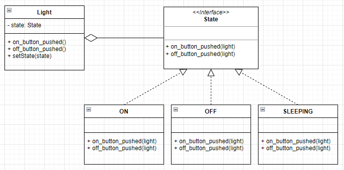

# 스테이트 패턴
- 객체는 자신이 처한 상태에 따라 일을 다르게 수행한다.
- 일을 수행할 때의 상태에 따라 상태 하나하나가 어떤 상태인지 검사해 일을 수행하도록 한다.
- 스테이트 패턴은 어떤 행위를 수행할 때 상태에 행위를 수행하도록 위임한다.


|객체|설명|
|--|--|
|State|시스템의 모든 상태에 공통의 인터페이스를 제공.|
|StateN|Context 객체가 요청한 작업을 자신의 방식으로 실제 실행.|
|Context|State를 이용하는 역할을 수행하며, 상태 변수를 통해 실제 행위를 결정한다.|

## 구현
예를 들어 형광들을 만든다고 하자. 형광등이 꺼져 있을 때 외부에서 On 버튼을 누르면 켜지고, Off 버튼을 누르면 꺼진다. 만약 이미 켜져 있는 상태에서 On 버튼을 누르면 그 상태 그대로 켜져있고, 꺼져 있는 상태에서 Off를 누르면 아무런 변화가 없다.


형광등의 상태를 표현하는 상수는 아래와 같다.
```java
private static int ON = 0;
private static int OFF = 1;
```
햔재 형광등의 상태를 저장하는 변수는 아래와 같다.
```java
private int state;
```
아래는 실제 동작되는 코드이다.

```java
public class Light {
    private static int ON = 0;
    private static int OFF = 1;
    private int state;

    public Light() {
        state = OFF; // 초기 상태는 OFF
    }

    public void on_button_pushed() {
        if (state == ON) {
            System.out.println("Nothing TODO...");
        } else {
            System.out.println("Light On.");
            state = ON;
        }
    }

    public void off_button_pushed() {
        if (state == OFF) {
            System.out.println("Nothing TODO...");
        } else {
            System.out.println("Light Off.");
            state = OFF;
        }
    }

    public class Client {
        public static void main(String[] args) {
            Light light = new Light();
            light.off(); // 반응 없음
            light.on(); 
            light.off();
        }
    }
}
```

## 문제점
- 형광등에 새로운 상태를 추가할 때 어떻게 될 것인가?

예를들어 취침등 상태가 새로 추가된다고 해보자.


취침들을 위한 새로운 상태값이 추가가 되어야 한다.
```java
private static int SLEEPING = 2;
```

그리고 추가된 취침등 상태 값에서 SLEEPING 상태로 변경이 되기위해서 버튼의 모든 조건문이 수정되어야 한다.
```java
public void on_button_pushed() {
    if (state == ON) {
        System.out.println("Sleeping Mode.");
        state = SLEEPING;
    } else if (state == SLEEPING) {
        System.out.println("Light On.");
        state = ON;
    } else {
        System.out.println("Light On.");
        state = ON;
    }
}
```

최종적으로 변경된 코드는 아래와 같다.

```java
public class Light {
    private static int ON = 0;
    private static int OFF = 1;
    private static int SLEEPING = 2; // 새로 추가된 상태
    private int state;

    public Light() {
        state = OFF; // 초기 상태는 OFF
    }

    public void on_button_pushed() {
        if (state == ON) {
            System.out.println("Sleeping Mode.");
            state = SLEEPING;
        } else if (state == SLEEPING) { // 새로 추가된 상태
            System.out.println("Light On.");
            state = ON;
        } else {
            System.out.println("Light On.");
            state = ON;
        }
    }

    public void off_button_pushed() {
        if (state == OFF) {
            System.out.println("Nothing TODO...");
        } else if (state == SLEEPING) { // 새로 추가된 상태
            System.out.println("Light Off.");
            state = OFF;
        } else {
            System.out.println("Light Off.");
            state = OFF;
        }
    }
}
```

상태 진입이 복잡한 조건문에 내포된 현재 구조는 현재 시스템의 상태 변화를 파악하기에 용이하지 않다. 또한 새로운 상태가 추가되는 경우에는 코드에 많은 변화가 발생되는 문제점이 생긴다.

## 해결책
- 변하는 부분을 찾아서 이를 캡슐화 시켜야 한다.
- 현재 시스템이 어떤 상태에 있는지와 상관없게 구성하고 상태 변화에도 독집적이도록 해야한다.

- Light(Context) 클래스에서 구체적인 상태 클래스가 아닌 추상화된 State 인터페이스만 참조한다.
- 따라서 현재 어떤 상태에 있는지와 무관하게 코드를 작성할 수 있다.
- Light 클래스에서는 상태 클래스에 작업을 위임한다.

```java
interface State {
    public void on_button_pushed(Light light);
    public void off_button_pushed(Light light);
}
```
```java
public class ON implements State {
    
    private static ON on = new ON(); // 싱글톤

    private ON() { }

    public static ON getInstance() { // 싱글톤 객체 반환
        return on;
    }

    @Override
    public void on_button_pushed(Light light) {
        System.out.println("Sleeping Mode.");
        light.setState(SLEEPING.getInstance());
    }

    @Override
    public void off_button_pushed(Light light) {
        System.out.println("Light Off.");
        light.setState(OFF.getInstance());
    }

}

public class OFF implements State {
    
    private static OFF off = new OFF(); // 싱글톤

    private OFF() { }

    public static OFF getInstance() { // 싱글톤 객체 반환
        return off;
    }

    @Override
    public void on_button_pushed(Light light) {
        System.out.println("Light On.");
        light.setState(ON.getInstance());
    }

    @Override
    public void off_button_pushed(Light light) {
        System.out.println("Nothing TODO...");
    }

}

public class SLEEPING implements State {
    
    private static SLEEPING sleeping = new SLEEPING(); // 싱글톤

    private SLEEPING() { }

    public static SLEEPING getInstance() { // 싱글톤 객체 반환
        return sleeping;
    }

    @Override
    public void on_button_pushed(Light light) {
        System.out.println("Light On.");
        light.setState(ON.getInstance());
    }

    @Override
    public void off_button_pushed(Light light) {
        System.out.println("Light Off.");
        light.setState(OFF.getInstance());
    }
    
}
```

Light 클래스의 상태인 ON과 OFF, SLEEPING 클래스를 캡슐화하여 State 인터페이스를 구현한다. 또한 상태 진입도 각 상태에서 처리하므로 조건문을 사용해 상태 변화를 나타낼 필요가 없다.

```java
public class Light {
    private State state;

    public Light() {
        state = new OFF();
    }

    public void setState(State state) {
        this.state = state;
    }

    public void on_buttond_pushed() {
        state.on_button_pushed(this);
    }

    public void off_buttond_pushed() {
        state.off_button_pushed(this);
    }
}
```

- Light 클래스의 state 변수를 통해 현재 시스템의 상태 객체를 참조한다.
- 상태에 따른 행위를 수행하려면 state 변수가 참조하는 상태 객체에 작업을 위임한다.
- Light 클래스는 구체적인 상태를 나타내는 객체를 참조하지 않기에, 시스템이 어떤 상태에 있는지와 무관하게 된다.
- 즉, Light(Context) 클래스는 전혀 영향을 받지 않게 된다.

> 참고 : Java 객체 지향 디자인 패턴 (한빛 미디어)