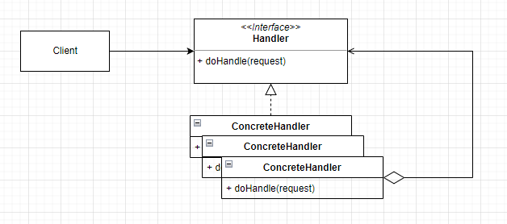

# 연쇄책임 패턴
- 클라이언트의 요청을 처리하기 위해 객체를 __체인 형태__ 로 전달.
- 결합력을 낮추기 위해 사용.
- 객체 자신이 요청을 어떻게 처리할지 결정하고 다음 체인으로 객체를 전달.


|객체|설명|
|--|--|
|Handler|요청을 처리하는 인터페이스를 정의|
|ConcreteHandler|책임져야 할 행동을 구현하며 잔신이 처리할 행동이 있으면 처리하고 그렇지 않으면 후속 처리자에게 처리요청.|
|Client|ConcreteHandler 객체에게 필요한 요청을 전달|

# 문제점
예를 들어 사용자의 요청을 검증하는 핸들러가 있다고 하자.
Request 객체는 사용자의 요청을 받고 header와 body를 가진다.
```java
public class Request {

	private String header;
	private String body;
	
	public String getHeader() {
		return header;
	}
	
	public void setHeader(String header) {
		this.header = header;
	}
	
	public String getBody() {
		return body;
	}
	
	public void setBody(String body) {
		this.body = body;
	}
	
}

```
Handler는 아래와 같이 인증과 문자를 검증하는 로직을 가지고 있다.
```java
public class RequestHandler {

	public void doHandle(Request request) throws Exception {
		checkAuth(request.getHeader());
		checkBody(request.getBody());
	}
	
	private void checkAuth(String header) throws Exception {
		if (header == null) {
			throw new RuntimeException("Authorization Exception!");
		}
		
		String[] keys = header.split(":");
		if (keys.length < 2) {
			throw new RuntimeException("Authorization Exception!");
		}
		
		if (!keys[1].equals("5402")) {
			throw new RuntimeException("Authorization Exception!");
		}
	}
	
	private void checkBody(String body) throws Exception {
		if (body.contains("exe") || body.contains("xml")) {
			throw new RuntimeException("Contains unauthorized characters.");
		}
	}
	
}
```
이럴경우 발생되는 문제점은 RequestHandler가 두 가지 역할(인증, 문자 검증)을 담당하게 된다.
즉 __단일 책임 원칙(SRP)__ 를 위배하게 된다.

그렇다면 SRP를 회피하기 위해 각각의 역할을 나눈다고 해보자.
```java
public interface Handler {
	
	void doHandle(Request request) throws Exception;
	
}

public class AuthHandler extends Handler {

    public void doHandle(Request requestr) {
        String header = request.getHeader();

		if (header == null) {
			throw new RuntimeException("Authorization Exception!");
		}
		
		String[] keys = header.split(":");
		if (keys.length < 2) {
			throw new RuntimeException("Authorization Exception!");
		}
		
		if (!keys[1].equals("5402")) {
			throw new RuntimeException("Authorization Exception!");
		}
	}

}

public class BodyHandler extends Handler {

    public void doHandle(Request request) throws Exception {
        String body = request.getBody();

		if (body.contains("exe") || body.contains("xml")) {
			throw new RuntimeException("Contains unauthorized characters.");
		}
	}

}

public class Client {

	public static void main(String[] args) throws Exception {
		Request request = new Request();
		request.setHeader("auth:5402");
		request.setBody("Hello DHL!");
		
		Handler handler = new AuthHandler();
        handler.doHandle(request);

        Handler handler = new BodyHandler();
        handler.doHandle(request);
	}
	
}
```
이럴경우 Client는 직접 Handler 객체를 지정하여 인스턴스를 생성 후 호출해야한다. Client는 Handler에 대해서 모두 알고있어야 한다는것이다. 추가적으로 중간에 새로운 Handler가 필요하게 되면 어느 시점에 처리해야할지도 고민해야한다.

# 구현
각 필터에서 구현할 인터페이스를 생성한다. 여기서 FilterChain은 등록된 필터를 순환하면서 다음 필터로 연결해주는 Chain클래스이다.

```java
public interface Filter {	
	void doFilter(Request request, FilterChain chain) throws Exception;

}
```
```java
public class FilterChain {

	private List<Filter> filters;
	private Iterator<Filter> itr;
	
	public FilterChain(List<Filter> filters) {
		this.filters = filters;
	}
	
	public void doFilter(Request request, FilterChain chain) throws Exception {
		if (itr == null) {
			itr = this.filters.iterator();
		}
		
		while (itr.hasNext()) {
			Filter filter = itr.next();
			filter.doFilter(request, chain);
		}
	}
	
}
```
FilterChain은 Filter를 담고있는 List와 Filter의 Iterator를 가진다. FilterChain객체는 각 Filter를 순환하면서 전달되고, FilterChain의 doFilter를 호출함으로써 다음 필터로 접근이 가능해진다.

아래는 각각의 필터들이 단일역할을 수행하면서 다음 필터를 호출하기위해 FilterChain의 doFilter를 호출한다. 만약에 자신의 역할에서 끝나게 되면 다음 필터는 호출되지 않는다.

```java
public class AuthFilter implements Filter {

	@Override
	public void doFilter(Request request, FilterChain chain) throws Exception {
		System.out.println("Do Auth Filter.");
        
        String header = request.getHeader();
		if (header == null) {
			throw new RuntimeException("Authorization Exception!");
		}
		
		String[] keys = header.split(":");
		if (keys.length < 2) {
			throw new RuntimeException("Authorization Exception!");
		}
		
		if (!keys[1].equals("5402")) {
			throw new RuntimeException("Authorization Exception!");
		}
		
		chain.doFilter(request, chain);
	}
	
}

public class BodyFilter implements Filter {

	@Override
	public void doFilter(Request request, FilterChain chain) throws Exception {
		System.out.println("Do Body Filter.");
        
        String body = request.getBody();
		
		if (body.contains("exe") || body.contains("xml")) {
			throw new RuntimeException("Contains unauthorized characters.");
		}
		
		chain.doFilter(request, chain);
	}
	
}
```

FilterManager는 클라이언트단 생성되며, Filter의 정보를 초기화하고 실제로 Filter를 태우기 위한 클래스이다.
```java
public class FilterManager {

	private List<Filter> filters;
	
	public FilterManager() {
		filters = new ArrayList<>();
		
		filters.add(new AuthFilter());
		filters.add(new BodyFilter());
	}
	
	public void doFilter(Request request) throws Exception {
		FilterChain chain = new FilterChain(this.filters);
		chain.doFilter(request, chain);
	}
	
}
```

Client는 FilterManager 객체를 생성하고 Request를 검증한다. 만약에 Filter에 걸러지지 않은 Request는 정상적으로 Body를 출력하게 된다.
```java
public class Client {

	public static void main(String[] args) throws Exception {
		Request request = new Request();
		request.setHeader("auth:5402");
		request.setBody("Hello DHL!");
		
		FilterManager manager = new FilterManager();
		manager.doFilter(request);
		
		System.out.println(request.getBody());
	}
	
}
```
```console
Do Auth Filter.
Do Body Filter.
Hello DHL!
```

만약에 인증 필터에서 정상적으로 처리되지 않을경우에는 아래와 같은 에러가 발생된다.
```java
public class Client {

	public static void main(String[] args) throws Exception {
		Request request = new Request();
		request.setHeader("auth:5401");
		request.setBody("Hello DHL!");
		
		FilterManager manager = new FilterManager();
		manager.doFilter(request);
		
		System.out.println(request.getBody());
	}
	
}
```
```console
Do Auth Filter.
Exception in thread "main" java.lang.RuntimeException: Authorization Exception!
	at com.pattern.chainofresponse.AuthFilter.doFilter(AuthFilter.java:20)
	at com.pattern.chainofresponse.FilterChain.doFilter(FilterChain.java:22)
	at com.pattern.chainofresponse.FilterManager.doFilter(FilterManager.java:19)
	at com.pattern.chainofresponse.Client.main(Client.java:11)
```

이 외에도 Body검증에서 정상적으로 처리되지 않을경우에는 아래와 같은 에러가 발생된다.
```java
public class Client {

	public static void main(String[] args) throws Exception {
		Request request = new Request();
		request.setHeader("auth:5402");
		request.setBody("Sample.exe");
		
		FilterManager manager = new FilterManager();
		manager.doFilter(request);
		
		System.out.println(request.getBody());
	}
	
}
```
```console
Do Auth Filter.
Do Body Filter.
Exception in thread "main" java.lang.RuntimeException: Contains unauthorized characters.
	at com.pattern.chainofresponse.BodyFilter.doFilter(BodyFilter.java:12)
	at com.pattern.chainofresponse.FilterChain.doFilter(FilterChain.java:22)
	at com.pattern.chainofresponse.AuthFilter.doFilter(AuthFilter.java:23)
	at com.pattern.chainofresponse.FilterChain.doFilter(FilterChain.java:22)
	at com.pattern.chainofresponse.FilterManager.doFilter(FilterManager.java:19)
	at com.pattern.chainofresponse.Client.main(Client.java:11)

```